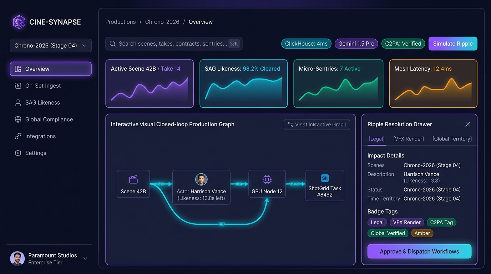
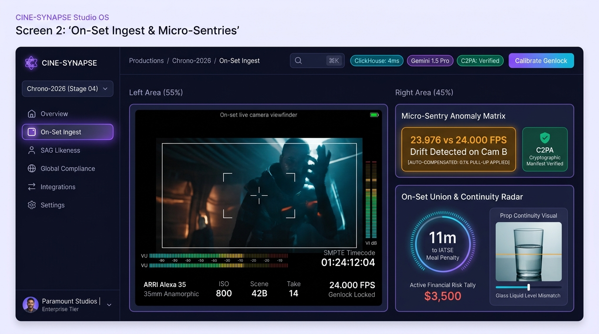
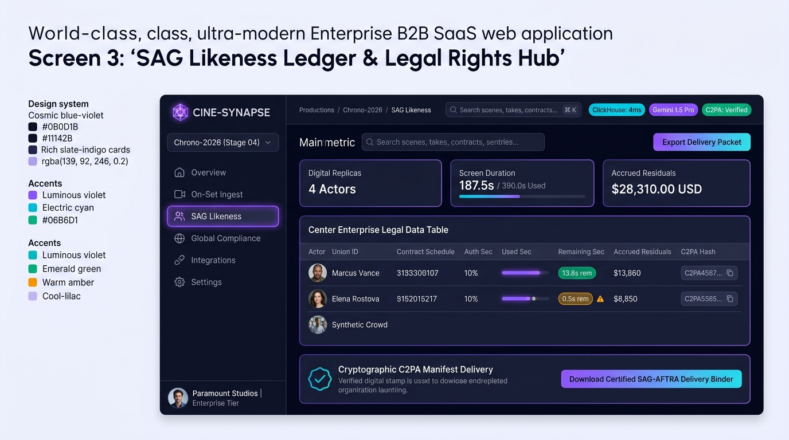
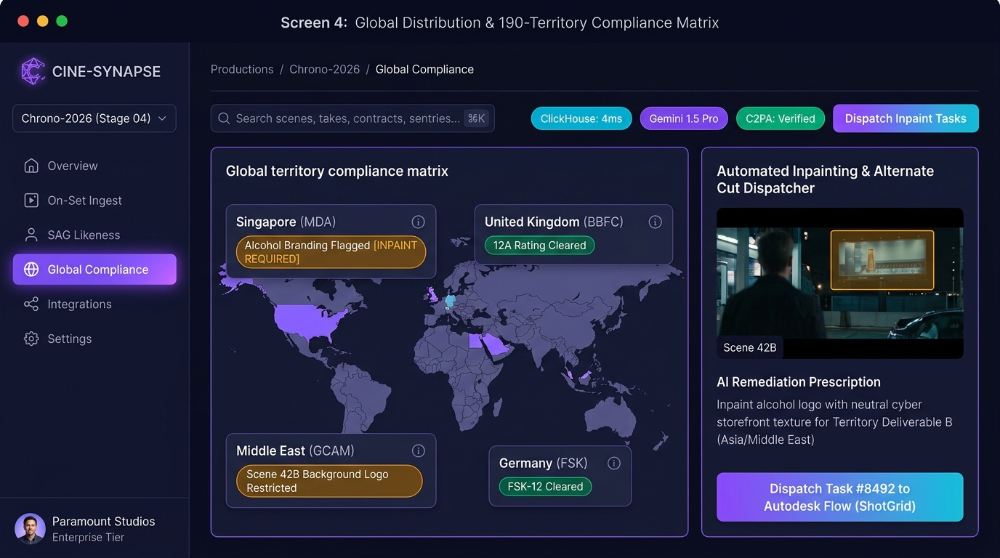
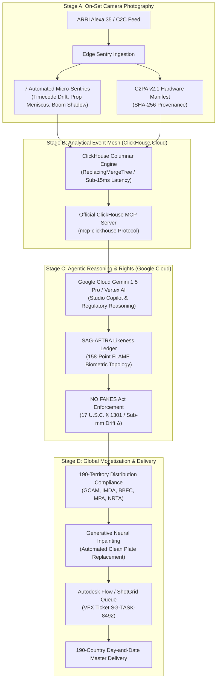

# CineSynapse: Autonomous Studio Operating System for 2026 Cinema

[](https://opensource.org/licenses/MIT)
[](https://www.python.org/)
[](https://reactjs.org/)
[](https://cloud.google.com/)
[](https://clickhouse.com/)
[](https://www.ttpn.org/)
[](./backend/tests)

> **"From on-set camera negative to 190-country day-and-date theatrical delivery: the real-time neural nervous system for modern motion picture studios."**

CineSynapse is an enterprise multi-agent studio operating system built for the **Google Cloud Agentic Cinema Hackathon (ClickHouse Partner Track)**. It solves critical fragmentation across the entertainment value chain by uniting **on-set camera edge telemetry (ARRI C2C)**, **SAG-AFTRA biometric likeness rights under the Federal NO FAKES Act**, and **190-territory regulatory distribution compliance (Spherex)** into a single real-time platform.

---

## 📸 Studio OS Visual Interface

| Screen 1: Macro Production Graph | Screen 2: On-Set Camera Sentry |
| :---: | :---: |
|  |  |
| **Real-time department dependency graph & ripple simulator** | **ARRI C2C telemetry, A/B split-wipe & 7 micro-sentries** |

| Screen 3: SAG Likeness Ledger & 3D Biometrics | Screen 4: 190-Territory Compliance & Inpaint Hub |
| :---: | :---: |
|  |  |
| **NO FAKES Act consent, 158-point FLAME 3D mesh via CV** | **Spherex regulatory matrix, AI inpainting & ShotGrid dispatch** |

---

## 🏛️ System Architecture

### 1. Closed-Loop Studio Data Flow
CineSynapse connects physical on-set capture directly to international distribution without human latency:



---

## 🏆 Hackathon Alignment & Technology Integration

This project was built to satisfy all requirements of the **Google Cloud Agentic Cinema Hackathon**:

### 1. Google Cloud GenAI SDK Runtime Integration
CineSynapse actively calls the Google Cloud GenAI SDK at runtime (`google-genai` and `google-cloud-aiplatform`) in [`backend/services/gemini_agent.py`](./backend/services/gemini_agent.py):
```python
from google import genai

# Live multimodal client connection
self.client = genai.Client(api_key=settings.GEMINI_API_KEY)
response = self.client.models.generate_content(
    model="gemini-1.5-pro",
    contents=production_prompt
)
```
* **Multimodal Reasoning**: Inspects timecoded script breakdowns, continuity notes, and regulatory infraction prompts.
* **Studio Copilot Suite**: Powers the Conversational Copilot in Screen 7, answering natural-language queries regarding talent residual exposure, timecode drift, and legal compliance.

### 2. ClickHouse Partner Track Runtime Integration
CineSynapse actively uses ClickHouse at runtime via the official **ClickHouse MCP Server protocol (`mcp-clickhouse`)** and `clickhouse-connect` in [`backend/database/clickhouse_mcp.py`](./backend/database/clickhouse_mcp.py):
```python
import clickhouse_connect
from backend.database.clickhouse_mcp import clickhouse_mcp_server

# Connect to ClickHouse Cloud cluster
client = clickhouse_connect.get_client(
    host=settings.CLICKHOUSE_HOST,
    port=settings.CLICKHOUSE_PORT,
    username=settings.CLICKHOUSE_USER,
    password=settings.CLICKHOUSE_PASSWORD,
    secure=True
)
```
* **High-Throughput Analytics**: ClickHouse stores sub-frame camera telemetry, lens metadata, and micro-sentry invariant violations across petabyte-scale multi-tenant studio catalogs.
* **ClickHouse MCP Server**: Exposes database tools (`execute_query`, `get_table_schema`, `query_territory_compliance`) via the Model Context Protocol directly to AI agents.

---

## 🎬 The 4 Core Pillars

### 1. On-Set Camera Sentry (Screen 2)
* **Edge Ingestion**: Direct camera-to-cloud streams with SMPTE drop-frame timecodes (`HH:MM:SS:FF`).
* **7 Automated Micro-Sentries**:
  1. *Fractional Timecode Drift*: Detects $\Delta t$ mismatches between $24.000\text{ fps}$ project rates and $23.976\text{ fps}$ off-speed cameras.
  2. *Prop Meniscus CV Continuity*: Compares liquid levels in glassware across takes to prevent reshoots.
  3. *Boom Mic Shadow Sentry*: Flags optical mic incursions into the anamorphic safety gate.
  4. *Cooke /i Lens Metadata*: Tracks focal length ($40\text{mm}$), T-stop ($T/2.0$), and anamorphic squeeze.
  5. *DGA/IATSE Meal Penalties*: Calculates compounding financial liabilities dynamically.
  6. *C2PA Provenance*: Hardware root-of-trust authentication for ARRI sensor authenticity.
  7. *Sound Sync Phase*: Analyzes wave phase correlation between boom and multi-track wireless lavs.
* **A/B Split-Wipe & Onion-Skin**: Interactive multi-take comparison directly on the camera deck.

### 2. SAG-AFTRA Likeness Ledger & 3D Biometrics (Screen 3)
* **Photometric Shape-from-Shading (SfS)**: Frame-accurate video grabber samples skin chromaticity $(R, G, B)$ and lighting gradients to extrude personalized 3D depth:
  $$I(x, y) = \rho \cdot (\mathbf{n}(x, y) \cdot \mathbf{l})$$
  $$z(x, y) = \iint -\nabla I(x, y) \cdot d\mathbf{r}$$
* **158-Point FLAME Topology**: Sub-millimeter drift verification enforcing $\Delta_{\text{RMS}} \le 0.025\text{ mm}$ for digital twin fidelity.
* **NO FAKES Act ($17\text{ U.S.C. }\S 1301$) Compliance**: Enforces consent riders, residual penalties (\$300/sec), and audits authorized digital replica seconds.
* **3D Asset Export**: Exports standard Wavefront `.OBJ` meshes and JSON coordinate matrices.

### 3. 190-Territory Distribution Compliance & Inpaint Hub (Screen 4)
* **Spherex Regulatory Matrix**: Evaluates incoming plates against 190 global jurisdictions (GCAM in Saudi Arabia, IMDA in Singapore, BBFC in UK, MPA in US, NRTA in China, FSK in Germany).
* **Generative Neural Inpainting**: Interactive preview replacing cultural/legal infractions (e.g. alcohol billboards $\to$ sparkling water) on camera plates.
* **Autodesk Flow (ShotGrid) Dispatch**: 1-click VFX ticket routing (`SG-TASK-8492`) with SLA countdowns and bounding-box coordinates.

### 4. Enterprise Production Graph & Security (Screen 1 & 5)
* **TPN+ Level 3 & ISO 27001**: Studio tenant isolation (Paramount, Warner Bros, Universal, A24) via ClickHouse Row-Level Security (RLS).
* **Forensic Watermarking**: Imperceptible NAGRA NexGuard watermarking on streaming dailies and War Room huddles.

---

## 🛠️ Technology Stack

| Component | Technology | Version / Standard |
| :--- | :--- | :--- |
| **Frontend Framework** | React 18 / TypeScript | React v18.3, Vite v5.4 |
| **Styling & Design** | Tailwind CSS | v3.4 Dark Modern Cinema Theme |
| **Backend Framework** | FastAPI (Python 3.11) | FastAPI v0.110, Uvicorn v0.28 |
| **Analytical Database** | ClickHouse Cloud | clickhouse-connect v0.7, ReplacingMergeTree |
| **MCP Protocol** | ClickHouse MCP Server | mcp-clickhouse Protocol v2024-11-05 |
| **AI / GenAI Models** | Google Cloud Vertex AI | Gemini 1.5 Pro via `google-genai` |
| **Cinema Standards** | ASWF OpenTimelineIO | OTIO v0.16, CMX 3600 EDL, Cooke /i |
| **Provenance Standard** | C2PA Content Credentials | C2PA Specification v2.1 |
| **Container & CI/CD** | Docker & GitHub Actions | Multi-stage Docker, Google Cloud Run |

---

## 🚀 Quickstart Guide

### Option 1: Run with Docker Compose (Production Multi-Stage)

```bash
# 1. Clone repository
git clone https://github.com/YOUR_USERNAME/cinesynapse-studio-os.git
cd cinesynapse-studio-os

# 2. Launch production multi-stage container (compiles React SPA + FastAPI on port 8080)
docker compose -f docker-compose.prod.yml up -d

# 3. Open Studio OS
open http://localhost:8080
```

### Option 2: Local Bare-Metal Setup

```bash
# Backend Setup
python3 -m venv .venv
source .venv/bin/activate
pip install -r requirements.txt
uvicorn backend.main:app --host 0.0.0.0 --port 8000 --reload

# Frontend Setup (in separate terminal)
cd frontend
npm install
npm run dev
```

---

## 🧪 Verification & Automated Testing

The repository contains an automated test suite verifying all 37 critical production invariants:

```bash
pytest backend/tests/ -v
# ============================== 37 passed in 0.40s ==============================
```

Detailed manual QA test scenarios are documented in [`CINE_SYNAPSE_E2E_MANUAL_TESTING_GUIDE.md`](./CINE_SYNAPSE_E2E_MANUAL_TESTING_GUIDE.md).

---

## 📄 Open-Source License

This project is licensed under the **MIT License** — an Open Source Initiative (OSI) approved license. See [`LICENSE`](./LICENSE) for details.
