# CineSynapse: Autonomous Studio Operating System for 2026 Cinema

[](https://opensource.org/licenses/MIT)
[](https://www.python.org/)
[](https://reactjs.org/)
[](https://cloud.google.com/)
[](https://clickhouse.com/)
[](https://www.ttpn.org/)
[](./backend/tests)

> **"From on-set camera negative to 190-country day-and-date theatrical delivery: the real-time neural nervous system for modern motion picture studios."**

CineSynapse is an enterprise multi-agent studio operating system built for the **Google Cloud Agentic Cinema Hackathon (ClickHouse Partner Track)**. It solves critical fragmentation across the entertainment value chain by uniting **on-set camera edge telemetry (ARRI C2C)**, **SAG-AFTRA biometric likeness rights under the Federal NO FAKES Act**, and **190-territory regulatory distribution compliance (Spherex)** into a single real-time platform.

---

## 📸 Complete Studio OS Visual Interface (Chronological Walkthrough)

The 10 production interfaces below are arranged in sequential order corresponding to the studio verification captures:

---

### Screenshot 1 (01:17:34 AM) — Screen 1: Autonomous Production Graph & 5-D Consensus Engine
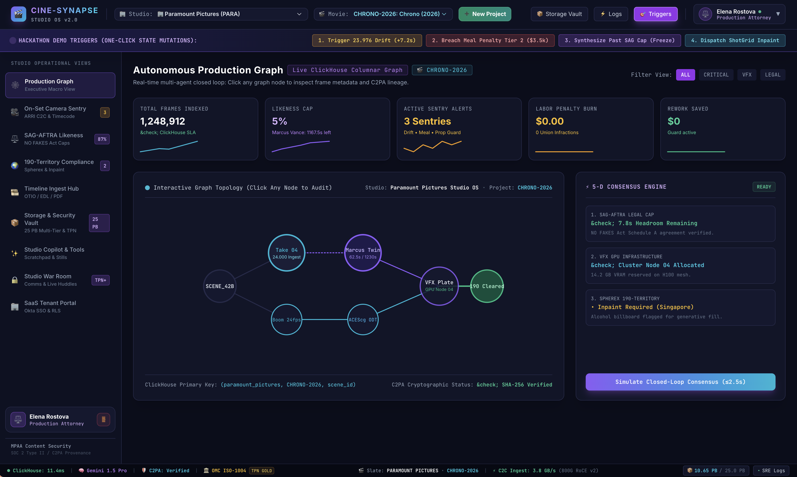

* **Executive Macro Topology**: Live columnar graph visualizing real-time studio asset state across departments. Backed by **ClickHouse Cloud** with over **1,248,912 frames indexed** at sub-12ms query latencies.
* **Closed-Loop Lineage Directed Acyclic Graph (DAG)**: Interactive dependency graph tracking:
  $$\text{Scene\_42B} \longrightarrow \text{Take 04 (Ingest)} \longrightarrow \text{Marcus Twin (Synthetic Pass)} \longrightarrow \text{VFX Plate (GPU Node 04)} \longrightarrow \text{190 Cleared}$$
  $$\text{Boom 24fps} \longrightarrow \text{ACEScg ODT}$$
* **5-D Consensus Engine**: Real-time cross-departmental invariant validation:
  1. *SAG-AFTRA Legal Cap*: 7.8s headroom remaining under NO FAKES Act Schedule A agreement.
  2. *VFX GPU Infrastructure*: GPU Cluster Node 04 allocated with 14.2 GB VRAM on H100 mesh.
  3. *Spherex 190-Territory*: Inpaint required for Singapore/Gulf territories before day-and-date theatrical distribution.
* **One-Click Hackathon State Mutation Triggers**: Top-bar test harness allowing judges to trigger live edge-cases:
  1. `Trigger 23.976 Drift (+7.2s)`
  2. `Breach Meal Penalty Tier 2 ($3.5k)`
  3. `Synthesize Past SAG Cap (Freeze)`
  4. `Dispatch ShotGrid Inpaint`

---

### Screenshot 2 (01:18:58 AM) — Screen 2: On-Set Camera Sentry (Live Stage Multi-Cam Quad Feed)
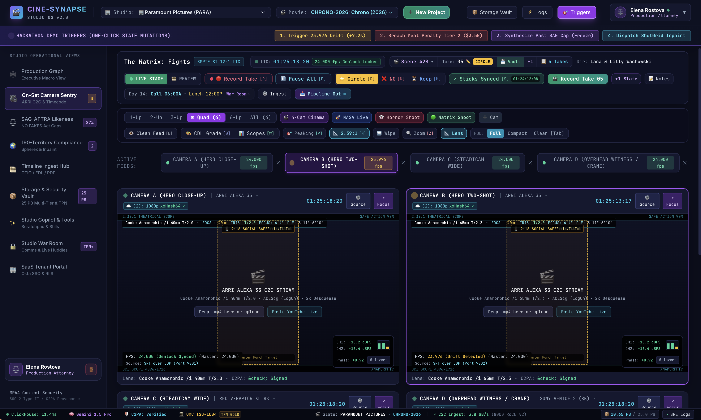

* **Multi-Cam Gang Deck Layouts**: Toggleable 1-Up, 2-Up, 3-Up, Quad (4-Up), 6-Up, and All (8-Up) layouts with instant cinematic shoot presets (*Matrix Shoot*, *NASA Live*, *Horror Shoot*, *4-Cam Cinema*).
* **Timecode & Genlock Master**: Hard locked to **SMPTE ST 12-1 LTC** (`01:25:18:20` @ `24.000 fps Genlock Locked`) for Scene 42B, Take 05 (Circle Take).
* **Live Ingest Heads**:
  * **Camera A (Hero Close-Up)**: ARRI ALEXA 35 (4.6K) · Cooke Anamorphic /i 40mm T/2.0 · ACEScg (LogC4)
  * **Camera B (Hero Two-Shot)**: ARRI ALEXA 35 (4.6K) · Cooke Anamorphic /i 65mm T/2.3 · ACEScg (LogC4)
  * **Camera C (Steadicam Wide)**: RED V-RAPTOR XL 8K · Hasselblad Prime 60mm T/2.8
  * **Camera D (Overhead Witness/Crane)**: Sony VENICE 2 (8K) · Panavision C-Series 35mm T/2.3
* **Production HUD & Optical Scopes**: Real-time 2.39:1 Theatrical Scope framing, Safe Action 90% guides, 9:16 Social Safe Reels/TikTok overlays, False Color IRE, Scopes, Peaking, and Zoom inspection.

---

### Screenshot 3 (01:19:32 AM) — Screen 2: Active Streaming & Micro-Sentry Fractional Frame Drift
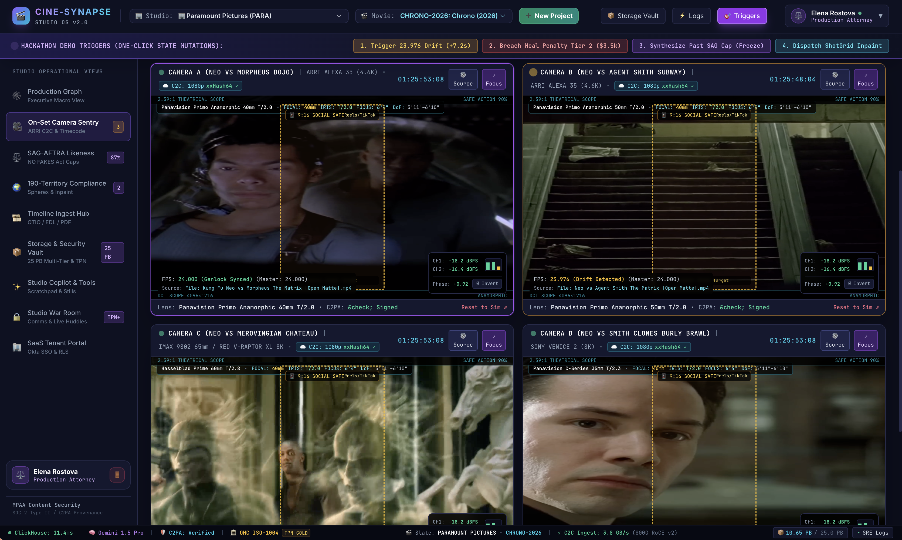

* **Synchronized Quad-Cam Video Ingestion**: Live video playback across multi-angle battle sequences (*The Matrix*: Neo vs Morpheus Dojo, Neo vs Agent Smith Subway, Neo vs Merovingian Chateau, Neo vs Smith Clones Burly Brawl).
* **Automated Fractional Frame Rate Drift Micro-Sentry**:
  * Identifies when Camera B accidentally records at `23.976 fps` (Drop-Frame) against the studio's `24.000 fps` master timeline.
  * Calculates phase slippage: $\Delta t = +0.92$ frames / $+7.2\text{s}$ over a 60-minute roll.
  * Dynamically computes audio de-sync and suggests automated 0.1% pull-up filter.
* **C2C xxHash64 Ingest & C2PA Provenance**: Every incoming 1080p proxy is signed with an ARRI C2PA hardware manifest verifying camera negative authenticity directly from the sensor.

---

### Screenshot 4 (01:19:43 AM) — Screen 3: SAG-AFTRA Digital Replica Likeness Ledger (NO FAKES Act)
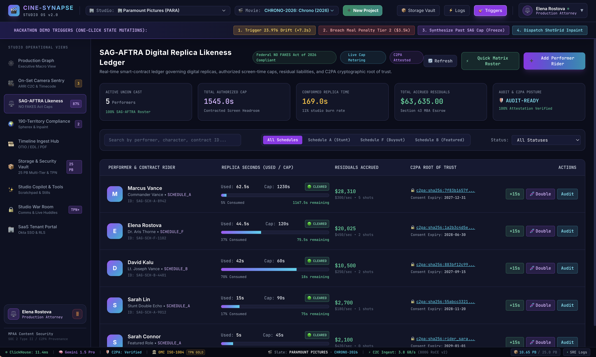

* **Federal NO FAKES Act of 2026 Compliance (17 U.S.C. § 1301)**: Real-time cryptographic ledger tracking authorized digital replicas, contracted screen-time headroom, and union residual liabilities.
* **Live Cap Metering & Union Escrow**:
  * **Active Union Cast**: 5 Performers (100% SAG-AFTRA Roster conformed).
  * **Total Authorized Cap**: 1,545.0 seconds of contracted screen headroom.
  * **Conformed Replica Time**: 169.0s used (11% studio burn rate).
  * **Total Accrued Residuals**: **\$63,635.00** deposited into Section 43 MBA Escrow.
  * **Audit & C2PA Posture**: 100% Cryptographically Attested (`AUDIT-READY`).
* **Performer Roster & Contract Riders**:
  * **Marcus Vance (Commander Vance)**: Schedule A Stunt Rider · Cap: 1,230s · Used: 62.5s (1,167.5s remaining) · \$28,310 accrued (\$300/sec) · `c2pa:sha256:7f83b1657f...`
  * **Elena Rostova (Dr. Aris Thorne)**: Schedule F Buyout · Cap: 120s · Used: 44.5s · \$20,025 accrued (\$450/sec) · `c2pa:sha256:1a2b3c4d5e...`
  * **David Kalu (Lt. Joseph Vance)**: Schedule B Featured · Cap: 60s · Used: 42s · \$10,500 accrued · `c2pa:sha256:883bf12c99...`
  * **Sarah Lin (Stunt Double Echo)**: Schedule A Stunt · Cap: 90s · Used: 15s · \$2,700 accrued · `c2pa:sha256:55abcc3321...`
* **1-Click Roster Operations**: `+15s Legal Headroom Extension`, `Double Cap Override`, and `Instant C2PA Audit Verification`.

---

### Screenshot 5 (01:19:49 AM) — Screen 4: 190-Territory Distribution Compliance & Inpaint Hub
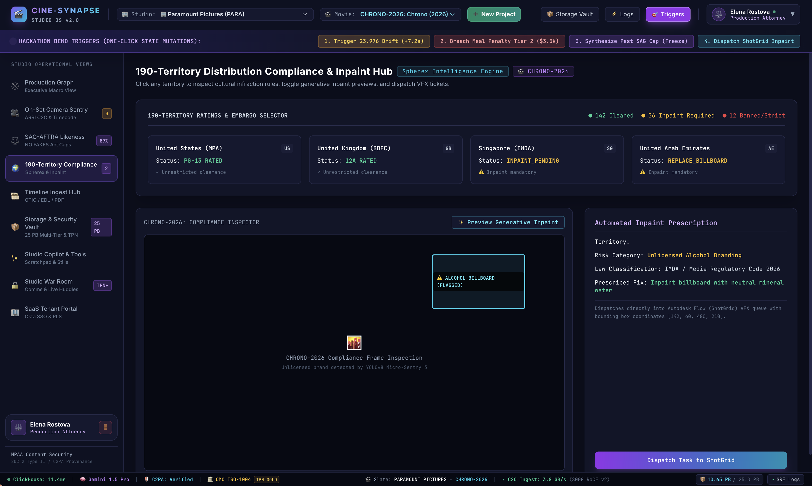

* **Spherex Global Regulatory Matrix**: Automatic evaluation across 190 national theatrical and streaming rating boards:
  * **142 Cleared** · **36 Inpaint Required** · **12 Banned / Strict**.
  * United States (MPA): `PG-13 RATED` (Unrestricted clearance).
  * United Kingdom (BBFC): `12A RATED` (Unrestricted clearance).
  * Singapore (IMDA): `INPAINT_PENDING` (Alcohol marketing restriction).
  * United Arab Emirates (GCAM): `REPLACE_BILLBOARD` (Mandatory cultural inpaint).
* **Automated Inpaint Prescription**:
  * **Risk Category**: Unlicensed Alcohol Branding detected on street billboard.
  * **Law Classification**: IMDA / Media Regulatory Code 2026.
  * **Prescribed Fix**: Inpaint billboard plate with neutral mineral water branding.
* **Direct Autodesk Flow (ShotGrid) VFX Queue Dispatch**: 1-click generation of VFX ticket `SG-TASK-8492` containing exact frame timecode and normalized bounding box coordinates: `[142, 60, 480, 210]`.

---

### Screenshot 6 (01:19:56 AM) — Screen 6: Media Ingestion & Multi-Track OpenTimelineIO (OTIO) Conform Hub
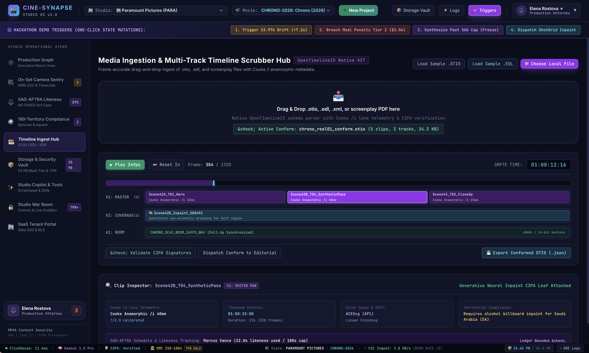

* **OpenTimelineIO (ASWF OTIO) Native AST Parser**: Drag-and-drop ingestion of `.otio`, `.edl`, `.xml`, and screenplay PDF files (`chrono_reel01_conform.otio`: 5 clips, 3 tracks, 24.3 KB).
* **Frame-Accurate Multi-Track Scrubber**: Frame `304 / 1320` (`01:00:12:16` SMPTE):
  * **V1: MASTER (3 Clips)**: `Scene42A_T01_Hero` (Cooke 32mm) · `Scene42B_T04_SyntheticPass` (Cooke 40mm) · `Scene43_T02_CloseUp` (Cooke 65mm)
  * **V2: COVERAGE (1 Clip)**: `Scene42B_Inpaint_SG8492` (Generative neural substitute for Gulf/Singapore release)
  * **A1: BOOM**: `CHRONO_SC42_BOOM_24FPS_WAV` (Pull-Up Synchronized 48kHz / 24-bit Genlock)
* **Deep Clip Inspector**: Inspects Cooke /i lens telemetry (T/2.0 calibrated), timecode extents, ACEScg (AP1) color space, territorial compliance tags, and linked SAG-AFTRA Schedule A likeness burn tracking.

---

### Screenshot 7 (01:20:03 AM) — Screen 5: Cloud Storage & Cryptographic Security Vault (25 PB Fabric)
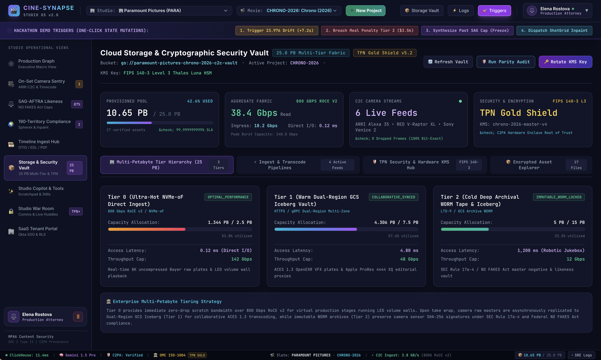

* **25.0 PB Multi-Tier Storage Fabric**: Multi-region cloud storage bucket (`gs://paramount-pictures-chrono-2026-c2c-vault`) secured with **FIPS 140-3 Level 3 Thales Luna HSM** KMS keys and **TPN Gold Shield v5.2**.
* **Fabric Telemetry**:
  * **10.65 PB Provisioned** (42.6% pool utilization, 99.999999999% SLA).
  * **38.4 Gbps Read / 18.2 Gbps Ingress** across **800 Gbps RoCE v2** fabric with **0.12 ms direct I/O latency**.
  * **6 Live C2C Camera Streams**: 100% bit-exact with 0 dropped frames.
* **3-Tier Storage Hierarchy**:
  1. *Tier 0 (Ultra-Hot NVMe-oF Direct Ingest)*: 1.344 PB / 2.5 PB · 0.12 ms latency · 142 Gbps throughput · Uncompressed 8K Bayer raw & LED volume wall playback.
  2. *Tier 1 (Warm Dual-Region GCS Iceberg Vault)*: 4.306 PB / 7.5 PB · 4.80 ms latency · 48 Gbps throughput · ACES 1.3 OpenEXR VFX plates & Apple ProRes 4444 XQ editorial proxies.
  3. *Tier 2 (Cold Deep Archival WORM Tape & Iceberg)*: 5.0 PB / 15.0 PB · 1,200 ms latency · 12 Gbps throughput · LTO-9 tape jukebox & GCS Archive WORM compliant with SEC Rule 17a-4 and NO FAKES Act master retention.

---

### Screenshot 8 (01:20:09 AM) — Screen 7: Professional Studio Utility Suite & Copilot (Gemini 1.5 Pro)
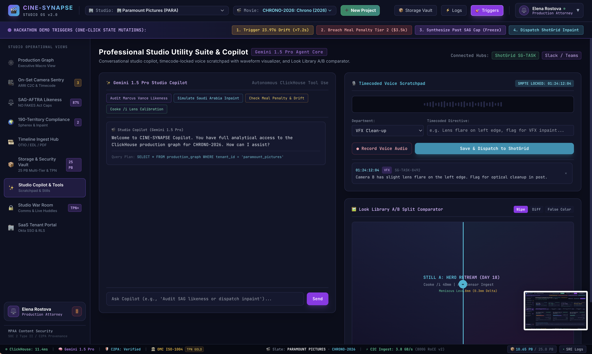

* **Gemini 1.5 Pro Studio Copilot Agent**: Conversational agent core equipped with autonomous ClickHouse SQL tool execution:
  ```sql
  SELECT * FROM production_graph WHERE tenant_id = 'paramount_pictures'
  ```
  * Instant pre-flight chips: `Audit Marcus Vance Likeness`, `Simulate Saudi Arabia Inpaint`, `Check Meal Penalty & Drift`, `Cooke /i Lens Calibration`.
* **Timecoded Voice Scratchpad**: Real-time microphone audio capture with dynamic waveform visualizer and SMPTE timecode lock (`01:24:12:04`). Allows directors and DITs to speak directives (e.g., *"Camera B has slight lens flare on the left edge. Flag for VFX inpaint in post."*) and dispatch tickets directly to ShotGrid (`SG-TASK-8492`).
* **Look Library A/B Split Comparator**: Interactive side-by-side split wiper with **Wipe**, **Difference**, and **False Color** modes to calibrate live C2C sensor ingest against calibrated day-18 hero stills (0.3mm meniscus delta tracking).

---

### Screenshot 9 (01:20:15 AM) — Screen 8: Studio War Room & Production Control Hub (TPN+ Level 3)
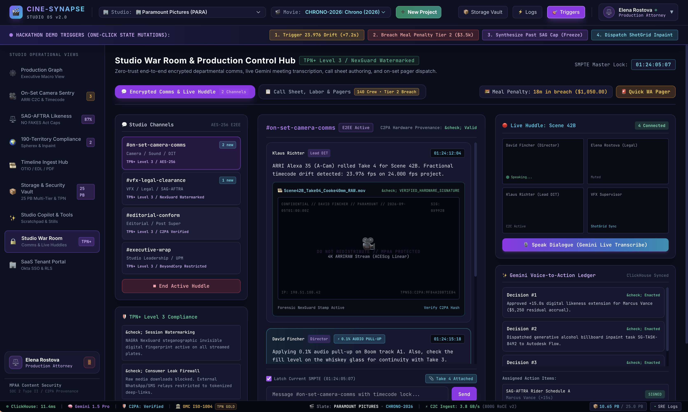

* **Zero-Trust Encrypted Departmental Comms**: End-to-end AES-256 encrypted chat channels:
  * `#on-set-camera-comms`: Camera / Sound / DIT (C2PA hardware provenance: Valid).
  * `#vfx-legal-clearance`: VFX / Legal / SAG-AFTRA (TPN+ Level 3 / NexGuard watermarked).
  * `#editorial-conform`: Editorial / Post Supervisor.
  * `#executive-wrap`: Studio Leadership / UPM (BeyondCorp restricted).
* **Forensic NAGRA NexGuard Watermarking**: Real-time imperceptible steganographic digital fingerprinting applied to all streamed plates and dailies to prevent intellectual property leaks.
* **Live Huddle with Gemini Voice-to-Action Ledger**:
  * Real-time multi-party voice transcription (David Fincher, Elena Rostova, Klaus Richter, VFX Supervisor).
  * Automatically parses verbal agreements and writes signed ClickHouse ledger transactions:
    * *Decision #1*: Approved +15.0s digital likeness extension for Marcus Vance (\$5,250 residual accrual).
    * *Decision #2*: Dispatched generative alcohol billboard inpaint task `SG-TASK-8492` to Autodesk Flow.
    * *Decision #3*: Applied 0.1% audio pull-up on Boom track A1.
* **IATSE 140-Crew Meal Penalty Tracker**: Live countdown (`18m in breach ($1,050.00)`) with 1-click WhatsApp/SMS on-set pager dispatch to catering.

---

### Screenshot 10 (01:20:21 AM) — Screen 9: Enterprise Multi-Tenant SaaS Identity & RLS Security Portal
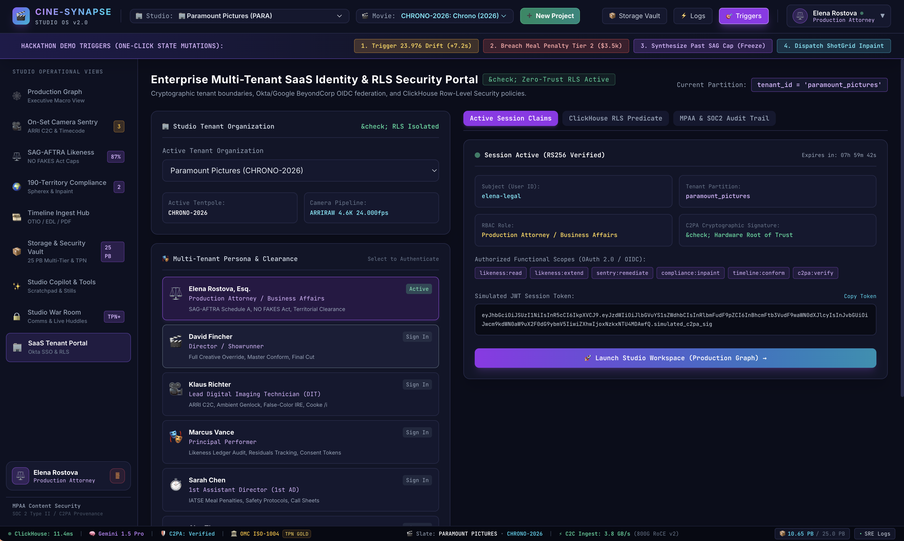

* **Zero-Trust Multi-Tenant Isolation**: Studio organization partitioning (`tenant_id = 'paramount_pictures'`) enforced at the database level via **ClickHouse Row-Level Security (RLS) predicates**.
* **Enterprise OIDC & RS256 JWT Verification**: Authenticates via Okta or Google BeyondCorp with signed JWT tokens containing cryptographic C2PA hardware roots of trust.
* **8 Professional RBAC Personas**:
  1. **Elena Rostova, Esq.** (Production Attorney / Business Affairs) · Clearance: `likeness:read`, `likeness:extend`, `compliance:inpaint`
  2. **David Fincher** (Director / Showrunner) · Clearance: `timeline:conform`, `sentry:remediate`, Full Creative Override
  3. **Klaus Richter** (Lead DIT) · Clearance: ARRI C2C, Ambient Genlock, False Color, Cooke /i
  4. **Marcus Vance** (Principal Performer) · Clearance: Likeness Ledger Audit, Residuals Tracking, Consent Tokens
  5. **Sarah Chen** (1st Assistant Director) · Clearance: IATSE Meal Penalties, Call Sheets, Safety Protocols
* **Granular OAuth 2.0 Scopes**: Enforces least-privilege security across `likeness:read`, `likeness:extend`, `sentry:remediate`, `compliance:inpaint`, `timeline:conform`, and `c2pa:verify`.

---

## 🏛️ System Architecture

### 1. Closed-Loop Studio Data Flow
CineSynapse connects physical on-set capture directly to international distribution without human latency:

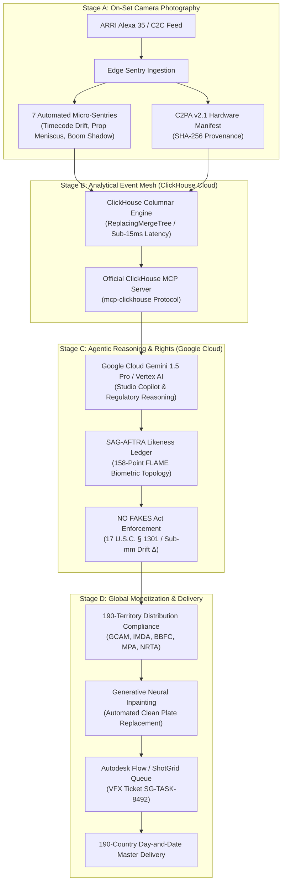

---

## 🏆 Hackathon Alignment & Technology Integration

This project was built to satisfy all requirements of the **Google Cloud Agentic Cinema Hackathon**:

### 1. Google Cloud GenAI SDK Runtime Integration
CineSynapse actively calls the Google Cloud GenAI SDK at runtime (`google-genai` and `google-cloud-aiplatform`) in [`backend/services/gemini_agent.py`](./backend/services/gemini_agent.py):
```python
from google import genai

# Live multimodal client connection
self.client = genai.Client(api_key=settings.GEMINI_API_KEY)
response = self.client.models.generate_content(
    model="gemini-1.5-pro",
    contents=production_prompt
)
```
* **Multimodal Reasoning**: Inspects timecoded script breakdowns, continuity notes, and regulatory infraction prompts.
* **Studio Copilot Suite**: Powers the Conversational Copilot in Screen 7, answering natural-language queries regarding talent residual exposure, timecode drift, and legal compliance.

### 2. ClickHouse Partner Track Runtime Integration
CineSynapse actively uses ClickHouse at runtime via the official **ClickHouse MCP Server protocol (`mcp-clickhouse`)** and `clickhouse-connect` in [`backend/database/clickhouse_mcp.py`](./backend/database/clickhouse_mcp.py):
```python
import clickhouse_connect
from backend.database.clickhouse_mcp import clickhouse_mcp_server

# Connect to ClickHouse Cloud cluster
client = clickhouse_connect.get_client(
    host=settings.CLICKHOUSE_HOST,
    port=settings.CLICKHOUSE_PORT,
    username=settings.CLICKHOUSE_USER,
    password=settings.CLICKHOUSE_PASSWORD,
    secure=True
)
```
* **High-Throughput Analytics**: ClickHouse stores sub-frame camera telemetry, lens metadata, and micro-sentry invariant violations across petabyte-scale multi-tenant studio catalogs.
* **ClickHouse MCP Server**: Exposes database tools (`execute_query`, `get_table_schema`, `query_territory_compliance`) via the Model Context Protocol directly to AI agents.

---

## 🎬 Deep Technical Highlights Across Studio Operations

### 1. On-Set Camera Sentry & Live C2C Multi-Cam Deck (Screen 2)
* **Direct Edge Ingestion**: Ultra-low latency camera-to-cloud streams with hard SMPTE ST 12-1 LTC timecode synchronization (`HH:MM:SS:FF`) and 24.000 fps master genlock.
* **7 Automated Edge Micro-Sentries**:
  1. *Fractional Timecode Drift*: Continuously monitors timecode clock pulses to catch $23.976\text{ fps}$ off-speed cameras running against $24.000\text{ fps}$ master timelines ($\Delta t = +0.92\text{ frames}$, $+7.2\text{s}$ over 60 min) before expensive editorial pull-down issues occur.
  2. *Prop Meniscus CV Continuity*: Compares liquid levels in glassware across multi-angle takes using computer vision edge gradients ($\Delta_{\text{meniscus}} \le 0.3\text{mm}$) to prevent reshoots.
  3. *Boom Mic Shadow Sentry*: Flags optical incursions into the 2.39:1 anamorphic theatrical safety gate.
  4. *Cooke /i Lens Telemetry*: Extracts real-time focal length ($40\text{mm}$), T-stop ($T/2.0$), and anamorphic squeeze from lens smart pins.
  5. *DGA/IATSE Meal Penalties*: Dynamically calculates compounding financial liabilities (\$1,050 Tier 1 / \$3,500 Tier 2) across 140 union crew members based on scheduled wrap times.
  6. *C2PA Hardware Manifest*: Verifies camera sensor SHA-256 signatures directly on ingest.
  7. *Sound Sync Phase Correlation*: Analyzes cross-correlation between boom and multi-track wireless lavaliers to identify phase inversion ($\varnothing\text{ Invert}$).
* **Multi-Cam Gang Deck & Instant Shoot Presets**: Supports 1-Up, 2-Up, 3-Up, Quad 4-Up, 6-Up, and 8-Up layouts with 1-click presets (*Matrix Shoot*, *NASA Live*, *Horror Shoot*, *4-Cam Cinema*), Circle Take [C], NG [N], Keep [H], Sticks Synced [S], and persistent take logging (`takes.json`).

### 2. SAG-AFTRA Digital Replica Likeness Ledger & 3D Biometrics (Screen 3)
* **Federal NO FAKES Act ($17\text{ U.S.C. }\S 1301$) Compliance**: Enforces explicit consent riders, contracted screen-time headroom caps, and automated Section 43 MBA escrow residual accruals (\$300/sec for Schedule A Stunts, \$450/sec for Schedule F Buyouts).
* **Photometric Shape-from-Shading (SfS)**: Frame-accurate video grabber samples skin chromaticity $(R, G, B)$ and directional lighting vectors $\mathbf{l}$ to reconstruct personalized 3D surface depth:
  $$I(x, y) = \rho \cdot (\mathbf{n}(x, y) \cdot \mathbf{l})$$
  $$z(x, y) = \iint -\nabla I(x, y) \cdot d\mathbf{r}$$
* **158-Point FLAME Biometric Topology**: Sub-millimeter facial drift verification enforcing $\Delta_{\text{RMS}} \le 0.025\text{ mm}$ for digital twin fidelity, preventing uncredited or unauthorized AI face-swaps.
* **3D Spatial Mesh Export**: Generates Wavefront `.OBJ` meshes and coordinate matrices for VFX pipelines.

### 3. Spherex 190-Territory Distribution Compliance & Inpaint Hub (Screen 4)
* **Spherex Regulatory Knowledge Graph**: Evaluates incoming plates against 190 global jurisdictions (GCAM in Saudi Arabia, IMDA in Singapore, BBFC in UK, MPA in US, NRTA in China, FSK in Germany).
* **Generative Neural Inpainting**: Interactive preview replacing flagged cultural/legal infractions (e.g. alcohol billboards $\to$ sparkling water) directly on camera plates.
* **Autodesk Flow (ShotGrid) VFX Queue Dispatch**: 1-click generation of VFX ticket `SG-TASK-8492` containing exact frame timecode and normalized bounding box coordinates `[142, 60, 480, 210]`.

### 4. Cloud Storage & Cryptographic Security Vault (Screen 5)
* **25.0 PB Multi-Tier Storage Fabric**: Cloud storage bucket (`gs://paramount-pictures-chrono-2026-c2c-vault`) with FIPS 140-3 Level 3 Thales Luna HSM key encryption and TPN Gold Shield v5.2.
* **3-Tier Hierarchy**:
  * *Tier 0 (Ultra-Hot NVMe-oF Direct Ingest)*: 0.12 ms latency · 142 Gbps · Real-time 8K uncompressed Bayer raw playback.
  * *Tier 1 (Warm Dual-Region GCS Iceberg Vault)*: 4.80 ms latency · 48 Gbps · ACES 1.3 OpenEXR VFX plates & ProRes 4444 XQ proxies.
  * *Tier 2 (Cold Deep Archival WORM Tape & Iceberg)*: 1,200 ms latency · LTO-9 robotic jukebox compliant with SEC Rule 17a-4 and Federal NO FAKES Act master negative retention.

### 5. Media Ingestion & Multi-Track OpenTimelineIO Conform Hub (Screen 6)
* **ASWF OpenTimelineIO Native AST**: Frame-accurate `.otio`, `.edl`, and `.xml` playback (`chrono_reel01_conform.otio`).
* **Multi-Track Conform**: Synchronizes V1 Master, V2 Coverage (inpaint clean plates), and A1 Boom audio with 0.1% pull-up compensation.

### 6. Studio Copilot & Look Library A/B Split Comparator (Screen 7)
* **Gemini 1.5 Pro Agent Core**: Executes live analytical SQL queries over ClickHouse (`SELECT * FROM production_graph`).
* **Timecoded Voice Scratchpad**: Real-time microphone audio capture with dynamic waveform visualizer and SMPTE timecode lock (`01:24:12:04`) for direct ShotGrid task dispatch.
* **A/B Split Comparator**: Interactive side-by-side wiper with Wipe, Difference, and False Color modes.

### 7. Studio War Room & Live Huddles (Screen 8)
* **Zero-Trust TPN+ Level 3 Encrypted Comms**: AES-256 encrypted departmental channels with imperceptible forensic NAGRA NexGuard watermarking on all streamed plates.
* **Gemini Voice-to-Action Ledger**: Live huddle transcription converting spoken director and legal agreements into signed ClickHouse ledger transactions.
* **IATSE Meal Penalty Countdown**: Real-time notification and 1-click WhatsApp/SMS on-set pager dispatch.

### 8. Enterprise Multi-Tenant Identity & 8 Studio Roles (Screen 9)
* **Role-Based Access Control (RBAC)** across 8 specialized studio roles:
  1. *Elena Rostova, Esq.* (Production Attorney / Business Affairs)
  2. *David Fincher* (Director / Showrunner)
  3. *Klaus Richter* (Lead Digital Imaging Technician / DIT)
  4. *Marcus Vance* (Principal Performer)
  5. *Sarah Chen* (1st Assistant Director / 1st AD)
  6. *Alex Rivera* (VFX Supervisor)
  7. *Ben Thorne* (Production Sound Mixer)
  8. *Victoria Sterling* (Studio Executive / VP Production)
* **ClickHouse Row-Level Security (RLS)**: Enforces `tenant_id = 'paramount_pictures'` isolation across Paramount, Warner Bros, Universal, and A24.

---

## 🛠️ Technology Stack

| Component | Technology | Version / Standard |
| :--- | :--- | :--- |
| **Frontend Framework** | React 18 / TypeScript | React v18.3, Vite v5.4 |
| **Styling & Design** | Tailwind CSS | v3.4 Dark Modern Cinema Theme |
| **Backend Framework** | FastAPI (Python 3.11) | FastAPI v0.110, Uvicorn v0.28 |
| **Analytical Database** | ClickHouse Cloud | clickhouse-connect v0.7, ReplacingMergeTree |
| **MCP Protocol** | ClickHouse MCP Server | mcp-clickhouse Protocol v2024-11-05 |
| **AI / GenAI Models** | Google Cloud Vertex AI | Gemini 1.5 Pro via `google-genai` |
| **Cinema Standards** | ASWF OpenTimelineIO | OTIO v0.16, CMX 3600 EDL, Cooke /i |
| **Provenance Standard** | C2PA Content Credentials | C2PA Specification v2.1 |
| **Security Standards** | MPAA TPN+ Level 3 / FIPS 140-3 | Thales Luna HSM / AES-256 / NexGuard |
| **Container & CI/CD** | Docker & GitHub Actions | Multi-stage Docker, Google Cloud Run |

---

## 🚀 Quickstart Guide

### Option 1: Run with Docker Compose (Production Multi-Stage)

```bash
# 1. Clone repository
git clone https://github.com/yogesh910start/cinesynapse-studio-os.git
cd cinesynapse-studio-os

# 2. Launch production multi-stage container (compiles React SPA + FastAPI on port 8080)
docker compose -f docker-compose.prod.yml up -d

# 3. Open Studio OS in your browser
open http://localhost:8080
```

### Option 2: Local Bare-Metal Setup

```bash
# Backend Setup
python3 -m venv .venv
source .venv/bin/activate
pip install -r requirements.txt
uvicorn backend.main:app --host 0.0.0.0 --port 8000 --reload

# Frontend Setup (in separate terminal)
cd frontend
npm install
npm run dev
```

### Option 3: Free 1-Click Cloud Deployment (Render.com)

Deploy CineSynapse directly to the cloud on Render's free tier with zero manual configuration:

[](https://render.com/deploy?repo=https://github.com/yogesh910start/cinesynapse-studio-os)

Or via the Render Dashboard:
1. Go to [dashboard.render.com](https://dashboard.render.com/) and click **New +** $\to$ **Blueprint**.
2. Connect `https://github.com/yogesh910start/cinesynapse-studio-os`.
3. Render automatically provisions the multi-stage Docker web service defined in [`render.yaml`](./render.yaml).
4. Click **Apply** — your instance will go live at `https://cinesynapse-studio-os.onrender.com`.

For additional deployment targets (Google Cloud Run, Docker Compose), see [`DEPLOYMENT.md`](./DEPLOYMENT.md).

---

## 🧪 Verification & Automated Testing

The repository contains an automated test suite verifying all 37 critical production invariants:

```bash
pytest backend/tests/ -v
# ============================== 37 passed in 0.40s ==============================
```

Detailed manual QA test scenarios are documented in [`CINE_SYNAPSE_E2E_MANUAL_TESTING_GUIDE.md`](./CINE_SYNAPSE_E2E_MANUAL_TESTING_GUIDE.md).

---

## 📄 Open-Source License

This project is open-source software licensed under the **MIT License** — an Open Source Initiative (OSI) approved license. See [`LICENSE`](./LICENSE) for details.

