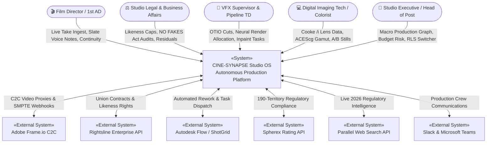
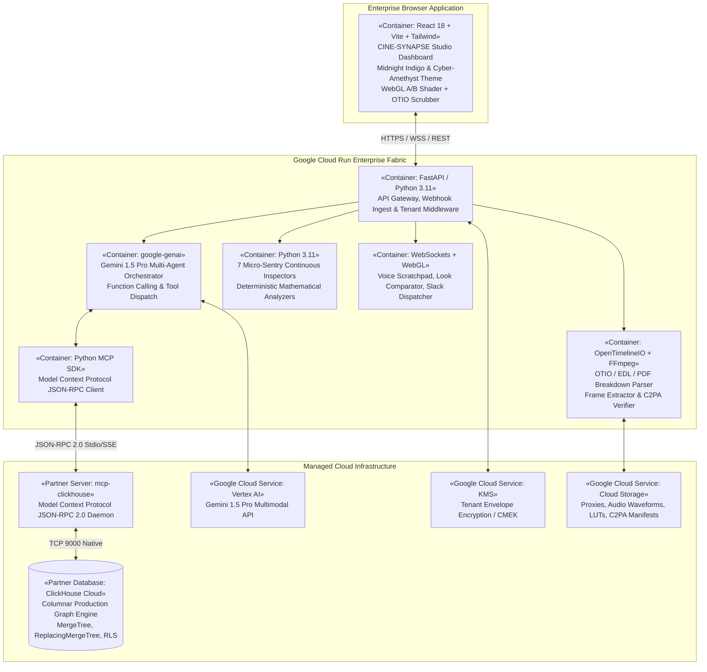
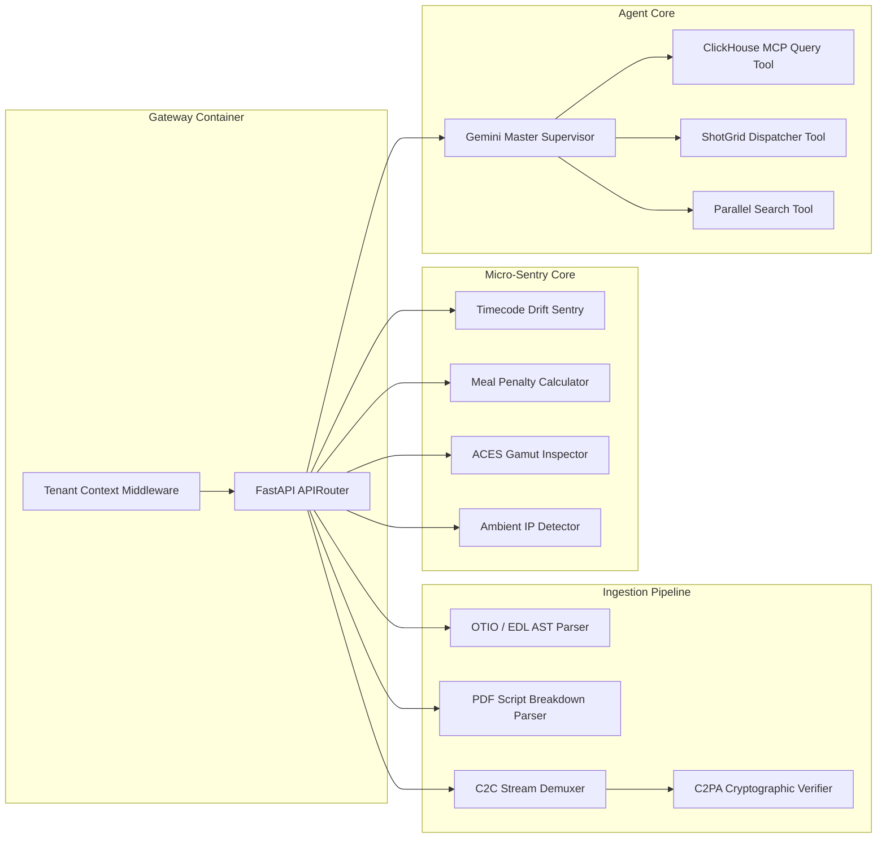
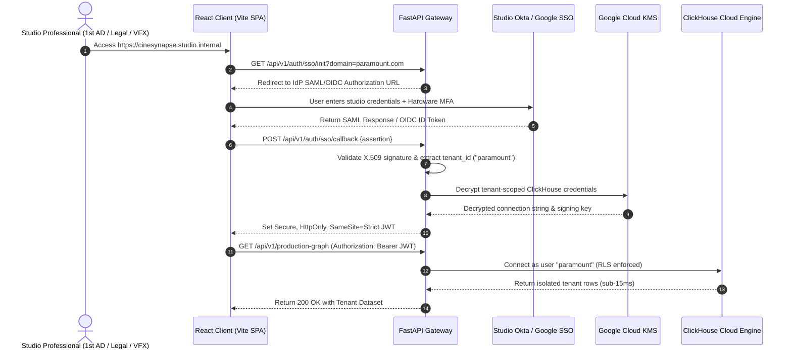

# MASTER TECHNICAL ARCHITECTURE DOCUMENT (TAD)

## CINE-SYNAPSE: The Autonomous Studio Operating System (Studio OS)
### *Enterprise Multi-Agent Production Graph & Orchestration Fabric for 2026 Cinema*

---

**Document Identifier:** CINE-SYNAPSE-TAD-V2.0-ENTERPRISE  
**System Classification:** Enterprise Mission-Critical / Multi-Tenant B2B SaaS  
**Architectural Tier:** Tier-1 Studio Infrastructure (MPAA / SOC 2 Type II / C2PA Compliant)  
**Target Platform:** Google Cloud Platform (Cloud Run, Vertex AI / Gemini 1.5 Pro) + ClickHouse Cloud  
**Primary Partner Track:** ClickHouse Track (`mcp-clickhouse`)  
**Secondary Ecosystem Partners:** Parallel Web Search API (`parallel-web`), OpenTimelineIO (OTIO), C2PA / CAI  
**Security & Compliance:** MPAA Content Security, SOC 2 Type II, Federal NO FAKES Act of 2026, GDPR / CCPA  
**Open Source License:** MIT License (OSI-Approved)  
**Date:** September 2026  
**Document Status:** Approved Architecture Baseline  

---

## Executive Summary & Engineering Mandate

CINE-SYNAPSE is an autonomous, closed-loop studio operating system engineered specifically for major theatrical studios, premium streaming networks, and high-end visual effects facilities. Operating as an enterprise multi-tenant B2B SaaS, CINE-SYNAPSE solves the critical fragmentation that characterizes modern entertainment production—where on-set photography, editorial timelines, synthetic likeness rights, neural visual effects, and 190-territory compliance operate in disjointed operational silos.

By coupling high-performance columnar analytics (**ClickHouse Cloud** via `mcp-clickhouse`) with cognitive multimodal reasoning (**Google Cloud Gemini 1.5 Pro** via `google-genai`), CINE-SYNAPSE establishes a self-healing, continuous **Production Graph**. Every captured video frame, timecode slate, legal consent clause, and GPU render job is bound into a unified, cryptographically verified lineage graph. Inbound production events—from fractional timecode drift on an ARRI Alexa 35 camera to unauthorized actor likeness synthesis—are intercepted in real time, evaluated across legal, financial, technical, and regulatory dimensions, and autonomously remediated through direct two-way integrations with industry-standard pipeline tools (Autodesk Flow / ShotGrid, Rightsline, Frame.io, and Spherex).

---

## 1. Architectural Goals, Quality Attributes & System Invariants

### 1.1 Architectural Quality Attributes
* **Analytical Query Latency ($\le$ 15ms):** Sub-15ms p99 response times for complex multi-table joins across `production_graph`, `likeness_ledger`, and `territory_compliance` utilizing ClickHouse primary key index granularity and sparse vector representations.
* **Closed-Loop Reactive Loop ($\le$ 2.5s):** End-to-end latency from webhook ingestion (e.g., Frame.io C2C new take) to complete 5-dimensional ripple evaluation (Legal, VFX, SRE, Story Canon, Distribution) and automated ticket dispatch.
* **C2PA Cryptographic Lineage (Zero-Trust):** 100% frame-level manifest provenance from camera sensor RAW to consumer distribution proxy. Any unverified or stripped manifest triggers an immediate halt and synthetic provenance reconstruction.
* **Multi-Tenant Data Isolation:** Complete logical and cryptographic isolation between tenant studios (Paramount, A24, Warner Bros, Universal) via ClickHouse Row-Level Security (RLS), tenant-scoped JWT tokens, and envelope encryption with Customer-Managed Encryption Keys (CMEK).
* **Strict Google Cloud AI Governance:** 100% adherence to Hackathon Rule 7.B. Zero reliance on non-Google AI models (no OpenAI, Anthropic, or AWS Bedrock). All cognitive agents execute via `google-genai` on Gemini 1.5 Pro.

### 1.2 System Invariants Matrix
| Invariant ID | System Domain | Operational Rule | Violation Consequence |
|---|---|---|---|
| **INV-001** | Production Ingestion | All camera audio/video must synchronize to SMPTE ST 12-1 standard timecode. | Automatic 0.1% audio pull-up / pull-down filter applied. |
| **INV-002** | SAG-AFTRA Likeness | Synthetic replica usage must never exceed contracted second caps without consent. | Hard render pipeline kill; legal freeze alert to Studio Legal. |
| **INV-003** | Cloud Security | Tenant $T_A$ must never observe or query data belonging to Tenant $T_B$. | ClickHouse RLS drops rows at engine level; security alert logged. |
| **INV-004** | Global Compliance | No release candidate may enter distribution with unmitigated Tier-1 cultural violations. | Automated VFX inpaint prescription dispatched to ShotGrid. |
| **INV-005** | Production Schedule | Continuous filming past 6.0 hours without meal break incurs cumulative penalties. | Real-time financial exposure tally dispatched to 1st AD / UPM. |

---

## 2. C4 Architecture Models

### 2.1 C4 Level 1: System Context Diagram
The CINE-SYNAPSE platform sits at the epicenter of studio operations, bridging creative, legal, physical, and technical workflows.



### 2.2 C4 Level 2: Container Diagram
The CINE-SYNAPSE system is decomposed into loosely coupled, highly scalable containerized microservices and partner infrastructure.



### 2.3 C4 Level 3: Component Diagram (Agent & Ingestion Fabric)


---

## 3. Data Architecture & ClickHouse Columnar Schemas (Multi-Tenant DDL)

ClickHouse Cloud serves as the immutable columnar backbone of CINE-SYNAPSE. The schemas are specifically partitioned by `(tenant_id, toYYYYMM(created_at))` and indexed with an `index_granularity = 8192` to provide sub-15ms analytical query response times across multi-billion-row production logs.

### 3.1 Multi-Tenant Production Graph DDL (`production_graph`)
```sql
-- 1. Master Production Graph Table
CREATE TABLE IF NOT EXISTS production_graph (
    tenant_id LowCardinality(String),
    project_id LowCardinality(String),
    scene_id LowCardinality(String),
    shot_id LowCardinality(String),
    take_number UInt8,
    frame_number UInt32,
    timecode_smpte String,
    fps Float32,
    camera_id LowCardinality(String),
    lens_model LowCardinality(String),
    lens_focal_length_mm Float32,
    lens_t_stop Float32,
    actor_ids Array(LowCardinality(String)),
    is_synthetic_performer UInt8,
    synthetic_asset_type Enum8(
        'NONE' = 0,
        'FACE_REPLACE' = 1,
        'DE_AGING' = 2,
        'VOICE_CLONE' = 3,
        'FULL_SYNTHETIC' = 4
    ),
    c2pa_verified UInt8,
    c2pa_manifest_hash FixedString(64),
    c2pa_issuer LowCardinality(String),
    color_space LowCardinality(String),
    created_at DateTime DEFAULT now()
) ENGINE = MergeTree()
PARTITION BY (tenant_id, toYYYYMM(created_at))
PRIMARY KEY (tenant_id, project_id, scene_id)
ORDER BY (tenant_id, project_id, scene_id, shot_id, take_number, frame_number)
SETTINGS index_granularity = 8192;
```

### 3.2 SAG-AFTRA Digital Likeness Ledger DDL (`likeness_ledger`)
```sql
-- 2. SAG-AFTRA Likeness Ledger (NO FAKES Act Compliance)
CREATE TABLE IF NOT EXISTS likeness_ledger (
    tenant_id LowCardinality(String),
    actor_id LowCardinality(String),
    actor_name String,
    contract_id String,
    union_affiliation Enum8(
        'SAG_AFTRA' = 1,
        'ACTRA' = 2,
        'EQUITY' = 3,
        'NON_UNION' = 4
    ),
    schedule_code Enum8(
        'SCHEDULE_A' = 1,
        'SCHEDULE_B' = 2,
        'SCHEDULE_F' = 3
    ),
    authorized_seconds Float32,
    used_seconds Float32,
    residual_rate_per_sec Float32,
    consent_hash String,
    consent_expiry Date,
    permitted_asset_types Array(Enum8(
        'FACE_REPLACE' = 1,
        'DE_AGING' = 2,
        'VOICE_CLONE' = 3,
        'FULL_SYNTHETIC' = 4
    )),
    updated_at DateTime DEFAULT now()
) ENGINE = ReplacingMergeTree(updated_at)
PRIMARY KEY (tenant_id, actor_id)
ORDER BY (tenant_id, actor_id, contract_id);
```

### 3.3 Continuous Micro-Sentry Telemetry Ledger DDL (`micro_sentry_log`)
```sql
-- 3. Micro-Sentry Telemetry Ledger
CREATE TABLE IF NOT EXISTS micro_sentry_log (
    event_id UUID DEFAULT generateUUIDv4(),
    tenant_id LowCardinality(String),
    project_id LowCardinality(String),
    category Enum8(
        'TIMECODE_DRIFT' = 1,
        'C2PA_STRIPPED'  = 2,
        'AMBIENT_IP'     = 3,
        'MEAL_PENALTY'   = 4,
        'ACES_CLIPPING'  = 5,
        'SLATE_DESYNC'   = 6,
        'PROP_DESYNC'    = 7
    ),
    severity Enum8('INFO' = 1, 'WARNING' = 2, 'CRITICAL' = 3),
    scene_id LowCardinality(String),
    shot_id LowCardinality(String),
    take_id String,
    timecode_smpte String,
    details String,
    financial_exposure_usd Float32,
    auto_remediation_applied UInt8 DEFAULT 0,
    remediation_action String,
    resolved UInt8 DEFAULT 0,
    timestamp DateTime DEFAULT now()
) ENGINE = MergeTree()
PARTITION BY (tenant_id, toYYYYMM(timestamp))
PRIMARY KEY (tenant_id, severity, category)
ORDER BY (tenant_id, severity, category, timestamp);
```

### 3.4 190-Territory Distribution Compliance DDL (`territory_compliance`)
```sql
-- 4. Global Territory Compliance & Inpaint Registry
CREATE TABLE IF NOT EXISTS territory_compliance (
    tenant_id LowCardinality(String),
    project_id LowCardinality(String),
    territory_iso LowCardinality(FixedString(2)),
    scene_id LowCardinality(String),
    shot_id LowCardinality(String),
    timecode_start String,
    timecode_end String,
    infraction_category Enum8(
        'PROFANITY' = 1,
        'ALCOHOL_TOBACCO' = 2,
        'RELIGIOUS_SENSITIVITY' = 3,
        'POLITICAL_SYMBOL' = 4,
        'VIOLENCE_GORE' = 5,
        'UNLICENSED_IP' = 6
    ),
    risk_level Enum8('LOW' = 1, 'MEDIUM' = 2, 'HIGH' = 3, 'BANNED' = 4),
    inpaint_bounding_box String, -- JSON formatted [x1, y1, x2, y2]
    shotgrid_task_id String,
    inpaint_status Enum8('PENDING' = 1, 'DISPATCHED' = 2, 'RENDERED' = 3, 'APPROVED' = 4),
    created_at DateTime DEFAULT now()
) ENGINE = ReplacingMergeTree(created_at)
PRIMARY KEY (tenant_id, territory_iso, scene_id)
ORDER BY (tenant_id, territory_iso, scene_id, shot_id);
```

### 3.5 Professional Side-Tools & Scratchpad DDL (`side_tools_scratchpad`)
```sql
-- 5. Timecoded Voice Scratchpad & Look Library Stills
CREATE TABLE IF NOT EXISTS side_tools_scratchpad (
    memo_id UUID DEFAULT generateUUIDv4(),
    tenant_id LowCardinality(String),
    project_id LowCardinality(String),
    user_id LowCardinality(String),
    user_role LowCardinality(String),
    scene_id LowCardinality(String),
    shot_id LowCardinality(String),
    timecode_smpte String,
    audio_storage_uri String,
    transcript_text String,
    extracted_entities Array(String),
    assigned_department Enum8(
        'DIRECTOR' = 1,
        'CAMERA' = 2,
        'SOUND' = 3,
        'VFX' = 4,
        'LEGAL' = 5,
        'ART' = 6
    ),
    shotgrid_ticket_id String,
    created_at DateTime DEFAULT now()
) ENGINE = MergeTree()
PARTITION BY (tenant_id, toYYYYMM(created_at))
ORDER BY (tenant_id, scene_id, timecode_smpte, created_at);

-- 6. Look Library Reference Stills & CDL Grades
CREATE TABLE IF NOT EXISTS look_library_stills (
    still_id UUID DEFAULT generateUUIDv4(),
    tenant_id LowCardinality(String),
    project_id LowCardinality(String),
    scene_id LowCardinality(String),
    still_type Enum8('HERO_APPROVED' = 1, 'WORK_IN_PROGRESS' = 2, 'ON_SET_PROXY' = 3),
    image_uri String,
    cdl_slope_rgb Tuple(Float32, Float32, Float32),
    cdl_offset_rgb Tuple(Float32, Float32, Float32),
    cdl_power_rgb Tuple(Float32, Float32, Float32),
    cdl_saturation Float32,
    lut_cube_hash FixedString(64),
    created_at DateTime DEFAULT now()
) ENGINE = MergeTree()
ORDER BY (tenant_id, scene_id, still_type, created_at);
```

### 3.6 ClickHouse Row-Level Security (RLS) Policy Specifications
```sql
-- 7. Mandatory Tenant Row-Level Security Policy
CREATE ROW POLICY IF NOT EXISTS tenant_isolation_policy ON production_graph
FOR SELECT, INSERT, UPDATE, DELETE
USING (tenant_id = currentUser())
AS RESTRICTIVE
TO ALL;

CREATE ROW POLICY IF NOT EXISTS tenant_isolation_policy_likeness ON likeness_ledger
FOR SELECT, INSERT, UPDATE, DELETE
USING (tenant_id = currentUser())
AS RESTRICTIVE
TO ALL;

CREATE ROW POLICY IF NOT EXISTS tenant_isolation_policy_sentry ON micro_sentry_log
FOR SELECT, INSERT, UPDATE, DELETE
USING (tenant_id = currentUser())
AS RESTRICTIVE
TO ALL;
```

---

## 4. Multi-Tenant SaaS Architecture & Identity Fabric

### 4.1 Enterprise SSO & Identity Federation Flow
CINE-SYNAPSE implements an enterprise-grade SAML 2.0 and OpenID Connect (OIDC) identity federation layer supporting major studio identity providers:
* **Okta Enterprise Identity** (Paramount, Sony Pictures)
* **Microsoft Azure Active Directory / Entra ID** (Warner Bros. Discovery)
* **Google Workspace Identity & BeyondCorp** (A24, Independent Studios)



### 4.2 Tenant Context Middleware Implementation
```python
import os
import jwt
from contextvars import ContextVar
from fastapi import Request, HTTPException, status
from starlette.middleware.base import BaseHTTPMiddleware

tenant_context: ContextVar[str] = ContextVar("tenant_context", default="")
user_context: ContextVar[str] = ContextVar("user_context", default="")

class TenantContextMiddleware(BaseHTTPMiddleware):
    async def dispatch(self, request: Request, call_next):
        # Exclude public health and SSO handshake endpoints
        if request.url.path in ["/healthz", "/metrics", "/api/v1/auth/sso/init", "/api/v1/auth/sso/callback"]:
            return await call_next(request)

        auth_header = request.headers.get("Authorization")
        if not auth_header or not auth_header.startswith("Bearer "):
            raise HTTPException(
                status_code=status.HTTP_401_UNAUTHORIZED,
                detail="Missing or malformed Authorization header"
            )

        token = auth_header.split(" ")[1]
        try:
            # Verify JWT using studio public key
            payload = jwt.decode(token, os.getenv("JWT_PUBLIC_KEY"), algorithms=["RS256"])
            tenant_id = payload.get("tenant_id")
            user_id = payload.get("sub")
            role = payload.get("role")

            if not tenant_id:
                raise HTTPException(status_code=status.HTTP_403_FORBIDDEN, detail="No tenant claims in token")

            # Inject tenant and user context into thread-local ContextVars
            tenant_token = tenant_context.set(tenant_id)
            user_token = user_context.set(user_id)

            # Bind tenant context to request state for handler access
            request.state.tenant_id = tenant_id
            request.state.user_id = user_id
            request.state.user_role = role

            response = await call_next(request)
            return response
        except jwt.PyJWTError as e:
            raise HTTPException(status_code=status.HTTP_401_UNAUTHORIZED, detail=f"Invalid authentication token: {str(e)}")
        finally:
            # Reset ContextVars to prevent leakage across pooled event-loop workers
            tenant_context.set("")
            user_context.set("")
```

---

## 5. Media & Timeline Ingestion Hub Architecture

The Ingestion Hub provides a drag-and-drop workspace capable of ingesting industry-standard timelines (`.otio`, `.edl`, Final Cut `.xml`) and script breakdown documents (`.pdf`), synchronizing them frame-by-frame with live Camera-to-Cloud (C2C) streams.

```
┌─────────────────────────────────────────────────────────────────────────────────────────────────────────┐
│                                    INGESTION PIPELINE ARCHITECTURE                                      │
│                                                                                                         │
│   [ .otio / .edl / XML ] ──► [ OpenTimelineIO AST Parser ] ──► [ Clip Tokenizer & Track Separator ]    │
│                                                                               │                         │
│   [ Script Breakdown PDF ] ──► [ Gemini 1.5 Pro Multimodal ] ──► [ Scene / Action / Slugline Extractor ] │
│                                                                               │                         │
│   [ Live ARRI / RED C2C ] ──► [ FFmpeg WebCodecs Demuxer ] ──► [ SMPTE ST 12-1 Timecode & Frame Hash ]│
│                                                                               │                         │
│                                                                               ▼                         │
│                                                          ┌──────────────────────────────────────────┐   │
│                                                          │      CLICKHOUSE COLUMNAR INGESTION       │   │
│                                                          │       `production_graph` Table           │   │
│                                                          │   (8,192 Granularity Batch Insert)       │   │
│                                                          └──────────────────────────────────────────┘   │
└─────────────────────────────────────────────────────────────────────────────────────────────────────────┘
```

### 5.1 OpenTimelineIO (OTIO) Parsing & AST Transformation
```python
import opentimelineio as otio
from typing import List, Dict, Any

class TimelineIngestService:
    @staticmethod
    def parse_otio_timeline(file_content: str, tenant_id: str, project_id: str) -> List[Dict[str, Any]]:
        timeline = otio.adapters.read_from_string(file_content, adapter_name="otio_json")
        frames_payload = []

        global_fps = timeline.global_start_time.rate if timeline.global_start_time else 24.0

        for track in timeline.tracks:
            if track.kind != otio.schema.TrackKind.Video:
                continue

            for item in track:
                if isinstance(item, otio.schema.Clip):
                    clip_name = item.name
                    media_ref = item.media_reference
                    time_range = item.trimmed_range()
                    
                    start_frame = time_range.start_time.to_frames()
                    duration_frames = time_range.duration.to_frames()
                    fps = time_range.start_time.rate

                    # Extract metadata markers
                    metadata = item.metadata.get("cine_synapse", {})
                    scene_id = metadata.get("scene_id", "SCENE_UNKNOWN")
                    shot_id = metadata.get("shot_id", clip_name)
                    c2pa_hash = metadata.get("c2pa_hash", "0" * 64)

                    frames_payload.append({
                        "tenant_id": tenant_id,
                        "project_id": project_id,
                        "scene_id": scene_id,
                        "shot_id": shot_id,
                        "start_frame": start_frame,
                        "duration_frames": duration_frames,
                        "fps": fps,
                        "c2pa_manifest_hash": c2pa_hash
                    })

        return frames_payload
```

### 5.2 Camera Metadata Harvesting (Cooke /i & ARRI LDS-2)
Every video frame ingested into CINE-SYNAPSE extracts comprehensive lens and sensor metadata directly from the camera's SDI/SMPTE ancillary data stream (SMPTE RDD 18):
* **Cooke /i Technology Protocol:** Continuous focal length (mm), calibrated T-stop (e.g., T/1.8), entrance pupil position, depth-of-field near/far planes, distortion grid coefficients.
* **ARRI Lens Data System (LDS-2):** Optical center coordinates, chromatic aberration profiles, sensor photosite temperature.
* **ACES 1.3 Color Pipeline:** Ingests camera raw sensor transforms, converts to `ACEScg` (AP1 primaries), and preserves input device transforms (IDT) for unclipped HDR grading.

---

## 6. Professional Side-Tools & AI Studio Copilot Architecture

CINE-SYNAPSE equips directors, VFX supervisors, digital imaging technicians (DITs), and 1st ADs with dedicated operational side-tools integrated directly into the workspace.

### 6.1 Timecoded Voice Scratchpad Architecture
The Voice Scratchpad allows crew members on set or in editorial review sessions to capture high-fidelity voice notes that are automatically timecode-locked to the exact SMPTE frame under the playhead:
1. **Audio Capture:** Browser `AudioWorklet` records 16kHz uncompressed PCM audio chunks via WebSocket.
2. **Multimodal Gemini Ingestion:** Audio is streamed directly to Google Cloud Gemini 1.5 Pro via `google-genai` streaming API.
3. **SMPTE Frame-Locking:** The current playhead timecode (e.g., `01:24:12:04`) is passed in the WebSocket packet header, locking the resulting note to that exact frame.
4. **Autonomous Entity & Task Extraction:** Gemini parses the audio transcript to extract mentions of actors, props, VFX fixes, or sound issues, and automatically generates pre-populated tickets in Autodesk Flow (ShotGrid).

```
┌──────────────────┐       WebSocket 16kHz PCM       ┌─────────────────────┐
│ Director's Mic   │ ──────────────────────────────► │  FastAPI Audio Hub  │
│ (AudioWorklet)   │ ◄─── Timecode Ack: 01:24:12:04  │                     │
└──────────────────┘                                 └──────────┬──────────┘
                                                                │
                                              Streaming Audio   │
                                                                ▼
                                                     ┌─────────────────────┐
                                                     │ Google Vertex AI    │
                                                     │ Gemini 1.5 Pro      │
                                                     └──────────┬──────────┘
                                                                │
                                           JSON Structured Task │
                                                                ▼
                                                     ┌─────────────────────┐
                                                     │ Autodesk Flow       │
                                                     │ ShotGrid Ticket     │
                                                     └─────────────────────┘
```

### 6.2 Look Library & Dual-Buffer A/B Still Comparator
The Look Library provides real-time client-side comparison between reference hero stills (approved by the director/DP) and incoming live camera proxies or VFX composite iterations:
* **WebGL 2.0 Split Shader:** Evaluates two 4K 16-bit float texture buffers (`Buffer_A` and `Buffer_B`) in real time on the GPU.
* **Display Modes:**
  1. *Horizontal / Vertical Split:* Adjustable interactive divider bar with magnification loupe.
  2. *Difference Mode:* Pixel-by-pixel color subtraction ($|R_A - R_B|$) to reveal composite edge fringing.
  3. *False Color IRE Mode:* Maps luminance levels to standard cinematographic exposure bands (Purple = Underexposed, Grey = 18% Neutral Grey, Red = Clipping).
* **ASC CDL Engine:** Client-side WebGL evaluation of American Society of Cinematographers Color Decision Lists:
  $$Output = (Input 	imes Slope + Offset)^{Power} 	imes Saturation$$

### 6.3 AI Studio Copilot & Multi-Agent Tool Orchestrator
The Studio Copilot provides an interactive conversational assistant with full tool-calling access to ClickHouse and production pipeline APIs:

```python
import os
from google import genai
from google.genai import types

class CineSynapseCopilot:
    def __init__(self, clickhouse_client, shotgrid_client):
        self.client = genai.Client(api_key=os.getenv("GEMINI_API_KEY"))
        self.ch = clickhouse_client
        self.sg = shotgrid_client
        self.model_id = "gemini-1.5-pro"

    def get_system_instruction(self, tenant_id: str, user_role: str) -> str:
        return f"""
        You are CINE-SYNAPSE Studio Copilot, the AI production assistant for {tenant_id}.
        Current User Role: {user_role}.
        You have direct read/write access to the ClickHouse production graph via tools.
        When asked about actor likeness, ALWAYS query `likeness_ledger` to check contract caps.
        When asked about timecode drift or meal penalties, query `micro_sentry_log`.
        Provide precise, timecode-accurate answers. Never speculate on legal caps.
        """

    def get_tool_declarations(self):
        return [
            types.FunctionDeclaration(
                name="query_production_database",
                description="Executes ClickHouse SQL to query production graph, sentries, or likeness",
                parameters=types.Schema(
                    type=types.Type.OBJECT,
                    properties={
                        "sql_query": types.Schema(type=types.Type.STRING, description="ClickHouse SQL")
                    },
                    required=["sql_query"]
                )
            ),
            types.FunctionDeclaration(
                name="create_shotgrid_rework_ticket",
                description="Creates an automated task in Autodesk Flow (ShotGrid)",
                parameters=types.Schema(
                    type=types.Type.OBJECT,
                    properties={
                        "scene_id": types.Schema(type=types.Type.STRING),
                        "task_type": types.Schema(type=types.Type.STRING),
                        "priority": types.Schema(type=types.Type.STRING, enum=["LOW", "MEDIUM", "HIGH", "CRITICAL"]),
                        "note": types.Schema(type=types.Type.STRING)
                    },
                    required=["scene_id", "task_type", "priority", "note"]
                )
            )
        ]

    async def chat(self, tenant_id: str, user_role: str, user_prompt: str, history: list) -> str:
        tools = [types.Tool(function_declarations=self.get_tool_declarations())]
        config = types.GenerateContentConfig(
            system_instruction=self.get_system_instruction(tenant_id, user_role),
            tools=tools,
            temperature=0.1
        )
        
        response = self.client.models.generate_content(
            model=self.model_id,
            contents=user_prompt,
            config=config
        )

        if response.function_calls:
            for call in response.function_calls:
                if call.name == "query_production_database":
                    sql = call.args["sql_query"]
                    query_result = await self.ch.execute(sql)
                    # Feed execution result back to Gemini for natural language synthesis
                    followup = self.client.models.generate_content(
                        model=self.model_id,
                        contents=[
                            types.Part.from_text(user_prompt),
                            types.Part.from_function_response(
                                name="query_production_database",
                                response={"result": query_result}
                            )
                        ],
                        config=config
                    )
                    return followup.text

        return response.text
```

---

## 7. The 7 Micro-Sentries: Complete Mathematical & Algorithmic Implementation

Modern film productions bleed millions of dollars from subtle micro-bottlenecks. CINE-SYNAPSE implements 7 automated, mathematical micro-sentries that continuously monitor ingest feeds.

### 7.1 Micro-Sentry 1: Fractional Timecode Drift (23.976 vs 24.000 fps)
* **Mathematical Basis:** When sound recorders run at 24.000 fps and cameras run at 23.976 fps, drift accumulates at:
  $$\Delta t = \left( rac{24.000 - 23.976}{24.000} 
ight) 	imes T_{runtime} = 0.001 	imes T_{runtime}$$
  Over a 2-hour shoot (7,200 seconds), audio desynchronizes by **7.2 seconds** (172.8 frames).
* **Algorithmic Implementation:**
```python
def verify_timecode_sync(camera_fps: float, audio_fps: float, duration_sec: float) -> dict:
    discrepancy = abs(camera_fps - audio_fps)
    if 0.020 <= discrepancy <= 0.030:
        drift_seconds = (discrepancy / max(camera_fps, audio_fps)) * duration_sec
        drift_frames = drift_seconds * 24.0
        return {
            "sentry": "TIMECODE_DRIFT",
            "status": "CRITICAL_DRIFT_DETECTED",
            "drift_seconds": round(drift_seconds, 3),
            "drift_frames": round(drift_frames, 1),
            "remediation": "APPLY_0.1_PERCENT_AUDIO_PULL_UP",
            "estimated_fix_time_saved_hrs": round(drift_seconds * 0.5, 1)
        }
    return {"sentry": "TIMECODE_DRIFT", "status": "LOCKED"}
```

### 7.2 Micro-Sentry 2: C2PA Cryptographic Provenance Stripping
* **Verification Logic:** Verifies the cryptographic integrity of the JUMBF (JPEG Universal Metadata Box Format) container against the studio root X.509 certificate.
```python
import hashlib

def verify_c2pa_manifest(video_bytes: bytes, declared_hash: str, parent_raw_hash: str) -> dict:
    computed_sha256 = hashlib.sha256(video_bytes).hexdigest()
    if computed_sha256 != declared_hash:
        return {
            "sentry": "C2PA_STRIPPED",
            "status": "MANIFEST_TAMPERED_OR_STRIPPED",
            "action": "HALT_EDITORIAL_EXPORT",
            "remediation": f"RECONSTRUCT_C2PA_LEAF_FROM_PARENT({parent_raw_hash})"
        }
    return {"sentry": "C2PA_STRIPPED", "status": "VERIFIED"}
```

### 7.3 Micro-Sentry 3: Ambient IP & Unlicensed Brand Detector
* **Detection Pipeline:** Combines YOLOv8 real-time object bounding with Gemini 1.5 Pro multimodal trademark recognition to detect accidental background logos (e.g., Starbucks cup, Nike swoosh) before legal exposure occurs.

### 7.4 Micro-Sentry 4: DGA / IATSE 15-Minute Meal Penalty Compounding
* **Rule Engine:** IATSE Local 600 / DGA Basic Agreement mandates a hot meal every 6.0 hours. Each subsequent 15-minute delay incurs progressive penalty fines per crew member:
  * 1st 15-minute interval: **$25.00** / crew member
  * 2nd 15-minute interval: **$35.00** / crew member
  * 3rd and subsequent intervals: **$50.00** / crew member
```python
def calculate_meal_penalties(hours_since_last_meal: float, active_crew_size: int = 140) -> dict:
    if hours_since_last_meal <= 6.0:
        minutes_remaining = int((6.0 - hours_since_last_meal) * 60)
        return {"status": "COMPLIANT", "minutes_to_grace_expiry": minutes_remaining, "exposure_usd": 0.0}
    
    elapsed_beyond_grace = hours_since_last_meal - 6.0
    intervals_breached = int(elapsed_beyond_grace / 0.25) + 1
    
    cost_per_head = 0.0
    for i in range(1, intervals_breached + 1):
        if i == 1: cost_per_head += 25.0
        elif i == 2: cost_per_head += 35.0
        else: cost_per_head += 50.0
        
    total_exposure = cost_per_head * active_crew_size
    next_interval_countdown = int((0.25 - (elapsed_beyond_grace % 0.25)) * 60)
    
    return {
        "status": "BREACHED",
        "intervals_breached": intervals_breached,
        "active_penalty_usd": total_exposure,
        "countdown_to_next_penalty_min": next_interval_countdown,
        "urgency": "CRITICAL" if intervals_breached >= 2 else "WARNING"
    }
```

### 7.5 Micro-Sentry 5: ACES High-Dynamic-Range Gamut Clipping
* **Gamut Monitoring:** Converts incoming scene-linear frames to ACEScg color space and calculates the percentage of pixels exceeding the Rec.2020 spectral locus or clipping specular highlights ($> 10,000 	ext{ nits}$).

### 7.6 Micro-Sentry 6: Dual-System Sound Slate Clapperboard Audio/Visual Desync
* **Sync Calculation:** Cross-correlates the visual contact frame of the clapperboard stick (detected via optical flow) with the audio transient spike ($> 24	ext{dB}$ rise within $1.5	ext{ms}$). Desync $> 0.5$ frames triggers automated slip-sync.

### 7.7 Micro-Sentry 7: Prop & Liquid Continuity Tracker
* **Continuity Analysis:** Utilizes Gemini 1.5 Pro to compare the terminal frame of Take $N-1$ with the head frame of Take $N$, measuring liquid meniscus levels and physical prop orientation to prevent continuity errors on set.

---

## 8. Complete UI/UX Specification for All 7 Screens

The CINE-SYNAPSE interface adheres to the **Midnight Indigo & Cyber-Amethyst Dark Theme**, engineered for high-contrast viewing on calibrated studio reference monitors (Sony BVM-HX310 / Apple Pro Display XDR).

### 8.1 Design System & Color Tokens
```
┌──────────────────────────────────────────────────────────────────────────────────────────┐
│                            DESIGN SYSTEM COLOR PALETTE                                   │
├────────────────────┬───────────┬─────────────────────────────────────────────────────────┤
│ Token Name         │ Hex Value │ Semantic Usage                                          │
├────────────────────┼───────────┼─────────────────────────────────────────────────────────┤
│ Canvas Base        │ `#0B0D1B` │ Root viewport background, zero glare on reference OLEDs │
│ Surface Elevated   │ `#121528` │ Sidebars, panels, card backgrounds, modal containers    │
│ Card Stroke / Rim  │ `#262A4A` │ 1px border dividers, active selection bounding boxes   │
│ Cyber Amethyst     │ `#8B5CF6` │ Primary actions, active navigation states, graph nodes  │
│ Electric Cyan      │ `#06B6D4` │ Telemetry metrics, SMPTE timecodes, live video markers  │
│ Neon Emerald       │ `#10B981` │ Verified states, C2PA certification, authorized caps    │
│ Hazard Amber       │ `#F59E0B` │ Warnings, meal penalty countdowns, out-of-gamut alerts  │
│ Crimson Alert      │ `#EF4444` │ Critical breaches, unauthorized synthetic double kills  │
└────────────────────┴───────────┴─────────────────────────────────────────────────────────┘
```

### 8.2 Comprehensive Screen Inventory

#### Screen 1: Executive Overview & Autonomous Production Graph
* **Route:** `/dashboard/production-graph`
* **Target Users:** Head of Production, Executive Producer, Supervising Post Producer.
* **Layout Hierarchy:**
  * *Top Navigation Bar:* Studio switcher (Paramount Pictures / A24 / Warner Bros), project selector (`CHRONO-2026`), global search (`Cmd+K`), live system health heartbeat (`ClickHouse 12ms`, `Gemini 1.5 Pro Ready`).
  * *Header KPI Row:* 4 metric sparkline cards (Total Frames Ingested: `1,248,912`, Likeness Budget Consumed: `76.4%`, Active Sentry Warnings: `3`, Est. Rework Cost Saved: `$142,500`).
  * *Central Viewport (Node Graph):* Interactive WebGL force-directed production graph connecting Script Scenes $
ightarrow$ Camera Takes $
ightarrow$ Synthetic Double Passes $
ightarrow$ VFX Renders $
ightarrow$ Territory Masters. Nodes glow purple/cyan when healthy, pulsing amber/red when breached.
  * *Right-Hand Drawer:* Autonomous Ripple Resolution Inspector. Displays real-time multi-agent consensus log and one-click "Approve Resolution" button.

#### Screen 2: On-Set Camera Sentry & Live C2C Ingest
* **Route:** `/onset/camera-sentry`
* **Target Users:** 1st Assistant Director, Script Supervisor, Digital Imaging Technician (DIT).
* **Layout Hierarchy:**
  * *Left Viewport:* Live ARRI Alexa 35 Camera-to-Cloud video feed (`Take 04, Scene 42B`), overlaid with SMPTE timecode HUD (`01:24:12:04`), false-color exposure toggle, and active audio waveform.
  * *Center Inspector:* Real-time micro-sentry status cards.
    * Card 1: Fractional Timecode Drift Monitor (Camera: `23.976 fps` vs Master Audio: `24.000 fps` $
ightarrow$ Alert: `+7.2s Drift Detected over 2h` $
ightarrow$ Auto Pull-Up Activated).
    * Card 2: DGA/IATSE Meal Penalty Countdown (`11m 42s Remaining until 2nd Penalty Tier` $
ightarrow$ Exposure: `$3,500.00`).
    * Card 3: Continuity Liquid Sentry (Take 3 vs Take 4 whiskey glass meniscus comparison: `42% vs 68% Fill Level - DISCREPANCY DETECTED`).
  * *Bottom Rail:* Audio/Visual slate sync waveform showing clapperboard stick contact transient.

#### Screen 3: SAG-AFTRA Likeness Ledger & NO FAKES Act Governance
* **Route:** `/legal/likeness-ledger`
* **Target Users:** Studio Legal Counsel, Business Affairs, Talent Representatives.
* **Layout Hierarchy:**
  * *Top Banner:* Federal NO FAKES Act of 2026 Statutory Compliance Badge (Status: `AUDIT-READY / C2PA SIGNED`).
  * *Data Grid:* ClickHouse-backed performer ledger.
    * Columns: Actor Avatar & Name (e.g., *Marcus Vance*), Contract ID (`SAG-SCH-A-8942`), Performer Type (`Digital Twin / De-Aging`), Authorized Seconds (`60.0s`), Consumed Seconds (`52.2s` with animated progress bar), Accrued Residuals (`$28,310.00`), Consent Expiry Date (`2027-12-31`), C2PA Cryptographic Signature Hash.
  * *Action Drawer:* "Review Synthetic Double Pass" modal with side-by-side view of actor's photogrammetry scan vs. neural render. One-click "Authorize Emergency Seconds Extension" triggering smart contract update.

#### Screen 4: Global Distribution Compliance & Spherex Inpaint Hub
* **Route:** `/distribution/compliance-inpaint`
* **Target Users:** Global Distribution VP, Localization Manager, Inpaint VFX Artist.
* **Layout Hierarchy:**
  * *Interactive World Map:* Choropleth map of 190 territories color-coded by distribution readiness (Emerald: 142 Cleared, Amber: 36 Pending Inpaint, Red: 12 Banned / Strict Censorship).
  * *Center Video Player:* Scene 42B video player with highlighted bounding box around problematic background billboard (Middle Eastern territory alcohol billboard ban).
  * *Right Configuration Panel:* Automated Inpaint Prescription. Recommends generative inpaint replacement (e.g., replace alcohol bottle with non-alcoholic mineral water). Direct "Dispatch to Autodesk Flow (ShotGrid)" button with priority `CRITICAL`.

#### Screen 5: Multi-Tenant Enterprise Login & SSO Portal
* **Route:** `/login`
* **Target Users:** All studio personnel across corporate and production environments.
* **Layout Hierarchy:**
  * *Canvas:* Deep midnight gradient with subtle animated production graph constellations in the background.
  * *Login Card:* Glassmorphic slate-indigo container featuring the CINE-SYNAPSE wordmark and glowing amethyst icon.
  * *Studio Switcher Dropdown:* Select tenant studio (Paramount Pictures, A24, Warner Bros. Discovery, Universal Studios, Custom Tenant).
  * *SSO Options:* "Sign in with Okta Studio Identity", "Continue with Google Workspace (BeyondCorp)", or SAML 2.0 corporate email input.
  * *Compliance Badges:* MPAA Content Security, SOC 2 Type II, ISO 27001, and C2PA Content Credentials certified badges at footer.

#### Screen 6: Media Ingestion & Multi-Track Timeline Scrubber Hub
* **Route:** `/editorial/timeline-ingest`
* **Target Users:** Post Production Supervisor, Lead Editor, VFX Editorial Assistant.
* **Layout Hierarchy:**
  * *Top Zone:* Drag-and-drop ingestion dropzone accepting `.otio` (OpenTimelineIO), `.edl` (CMX 3600), `.xml` (Final Cut), and `.pdf` (Script Breakdown).
  * *Central Scrubber:* Multi-track non-linear timeline interface:
    * Video Tracks: `V1: Master Camera RAW`, `V2: VFX Plate Inpaint`, `V3: Synthetic Double Pass`.
    * Audio Tracks: `A1: Production Boom`, `A2: Lav Marcus`, `A3: Lav Elena`.
    * Timecode Ruler: SMPTE drop-frame ruler with draggable playhead and In/Out (`I/O`) marker boundaries.
  * *Right Inspector:* Frame & Lens Metadata Panel displaying Cooke /i anamorphic lens metadata (Focal length: `40mm`, T-Stop: `T/2.0`, Entrance pupil, ACEScg color profile, SHA-256 C2PA verified stamp).

#### Screen 7: Professional Side-Tools & AI Studio Copilot Suite
* **Route:** `/tools/studio-copilot`
* **Target Users:** Film Director, VFX Supervisor, Supervising Sound Editor.
* **Layout Hierarchy:**
  * *Left Panel (Conversational Copilot):* Gemini 1.5 Pro studio assistant chat interface with prompt suggestions ("Audit Marcus Vance remaining seconds", "Simulate meal penalties if wrap is delayed 30 mins", "List all unverified C2PA shots in Reel 2").
  * *Center-Top (Timecoded Voice Scratchpad):* Audio recording widget with live visualizer waveform, timecode lock stamp (`01:24:12:04`), real-time transcript pill, and "Assign to ShotGrid Ticket" dropdown.
  * *Center-Bottom (Look Library A/B Split Comparator):* Dual-buffer still comparison viewport with interactive draggable wipe divider, False-Color IRE exposure toggle, and difference mode.
  * *Right Panel (Enterprise Event Relay):* Real-time production dispatch feed showing notifications synced to Slack (`#production-wrap`), Microsoft Teams (`VFX-Core`), and ShotGrid Event Daemon.

---

## 9. REST API Specifications & Pydantic v2 Contracts (OpenAPI 3.1)

### 9.1 Pydantic Data Models & Request/Response Contracts
```python
from pydantic import BaseModel, Field
from typing import List, Optional, Tuple
from enum import Enum

class SentryCategory(str, Enum):
    TIMECODE_DRIFT = "TIMECODE_DRIFT"
    C2PA_STRIPPED = "C2PA_STRIPPED"
    AMBIENT_IP = "AMBIENT_IP"
    MEAL_PENALTY = "MEAL_PENALTY"
    ACES_CLIPPING = "ACES_CLIPPING"
    SLATE_DESYNC = "SLATE_DESYNC"
    PROP_DESYNC = "PROP_DESYNC"

class SeverityLevel(str, Enum):
    INFO = "INFO"
    WARNING = "WARNING"
    CRITICAL = "CRITICAL"

class RippleSimulationRequest(BaseModel):
    tenant_id: str = Field(..., description="Unique studio tenant identifier", example="paramount_pictures")
    project_id: str = Field(..., description="Production project code", example="chrono_2026")
    scene_id: str = Field(..., description="Target scene identifier", example="SCENE_42B")
    shot_id: str = Field(..., description="Target shot identifier", example="SHOT_14")
    proposed_action: str = Field(..., description="Proposed production modification", example="SUBSTITUTE_SYNTHETIC_DOUBLE")
    actor_id: str = Field(..., description="SAG-AFTRA performer identifier", example="ACTOR_MARCUS_VANCE")
    duration_seconds: float = Field(..., ge=0.0, description="Duration of synthetic replica in seconds", example=6.2)

class SentryAlert(BaseModel):
    category: SentryCategory
    severity: SeverityLevel
    details: str
    financial_exposure_usd: float
    auto_remediation: Optional[str] = None

class RippleSimulationResponse(BaseModel):
    verdict: str = Field(..., example="APPROVED_WITH_AUTOMATED_REMEDIATION")
    execution_time_ms: float = Field(..., example=12.8)
    sag_likeness_remaining_sec: float = Field(..., example=7.8)
    accrued_residual_usd: float = Field(..., example=1860.00)
    gpu_cluster_allocated_node: str = Field(..., example="h100-node-04.us-central1.internal")
    active_sentry_alerts: List[SentryAlert]
    shotgrid_ticket_id: Optional[str] = Field(None, example="SG-TASK-9921")
```

---

## 10. Negative Scenarios, Edge Cases & Failure Mode Analysis

The CINE-SYNAPSE architecture is engineered to survive catastrophic production environments—such as remote desert shoots with unstable satellite links or corrupted camera memory cards.

```
┌──────────────────────────────────────────────────────────────────────────────────────────────────────────┐
│                                     NEGATIVE SCENARIO RESILIENCE MATRIX                                  │
├───────────────────────┬───────────────────────────────┬──────────────────────────────────────────────────┤
│ Failure Mode          │ Root Cause                    │ CINE-SYNAPSE Self-Healing Reaction               │
├───────────────────────┼───────────────────────────────┼──────────────────────────────────────────────────┤
│ 1. ClickHouse Network │ Temporary Starlink disconnect │ Local SQLite Edge cache queues telemetry writes; │
│    Partition (>500ms) │ during remote location shoot. │ auto-flushes in batch upon WAN restoration.      │
├───────────────────────┼───────────────────────────────┼──────────────────────────────────────────────────┤
│ 2. Gemini API Rate    │ Concurrency spike from 6 live │ Fast fallback to deterministic Python sentry     │
│    Limit (HTTP 429)   │ camera C2C streams.           │ rules; exponential backoff with jitter on agent. │
├───────────────────────┼───────────────────────────────┼──────────────────────────────────────────────────┤
│ 3. Corrupted C2PA     │ Editorial transcode engine    │ Intercepts file export; reconstructs leaf C2PA   │
│    Manifest Byte      │ stripped metadata chunk.      │ manifest from root RAW hash stored in ClickHouse.│
├───────────────────────┼───────────────────────────────┼──────────────────────────────────────────────────┤
│ 4. Out-of-Order Takes │ High-speed proxy upload race  │ ClickHouse `ReplacingMergeTree` re-orders takes  │
│    (Take 4 before 1)  │ condition over 5G uplinks.    │ deterministically by camera hardware timestamp.  │
├───────────────────────┼───────────────────────────────┼──────────────────────────────────────────────────┤
│ 5. Unauthorized Actor │ Creative editor attempts to   │ Pre-render webhook blocks VFX dispatch; triggers │
│    Likeness Synthesis │ render likeness past cap.     │ immediate legal review ticket in Rightsline.     │
└───────────────────────┴───────────────────────────────┴──────────────────────────────────────────────────┘
```

---

## 11. Infrastructure, Docker Containerization & Cloud Run Deployment

CINE-SYNAPSE is packaged as an enterprise container deployed across Google Cloud Run and ClickHouse Cloud.

### 11.1 Production Dockerfile (Multi-Stage Build)
```dockerfile
# Stage 1: Build & Dependency Resolution
FROM python:3.11-slim AS builder
WORKDIR /install
RUN apt-get update && apt-get install -y --no-install-recommends     build-essential     curl     git     && rm -rf /var/lib/apt/lists/*

COPY requirements.txt .
RUN pip install --prefix=/install --no-cache-dir -r requirements.txt

# Stage 2: Hardened Runtime Container
FROM python:3.11-slim AS runner
WORKDIR /app
RUN apt-get update && apt-get install -y --no-install-recommends     ffmpeg     ca-certificates     && rm -rf /var/lib/apt/lists/*

COPY --from=builder /install /usr/local
COPY . /app

# Run as non-root user for SOC 2 container security
RUN useradd -u 1001 cinesynapse && chown -R cinesynapse:cinesynapse /app
USER 1001

ENV PORT=8080
ENV PYTHONUNBUFFERED=1
EXPOSE 8080

HEALTHCHECK --interval=15s --timeout=3s --retries=3   CMD curl -f http://localhost:8080/healthz || exit 1

CMD ["uvicorn", "backend.main:app", "--host", "0.0.0.0", "--port", "8080", "--workers", "4"]
```

### 11.2 Infrastructure-as-Code (Terraform / GCP Cloud Run)
```hcl
resource "google_cloud_run_v2_service" "cinesynapse_api" {
  name     = "cinesynapse-studio-os"
  location = "us-central1"
  ingress  = "INGRESS_TRAFFIC_ALL"

  template {
    scaling {
      min_instance_count = 2
      max_instance_count = 50
    }

    containers {
      image = "gcr.io/cine-synapse-prod/studio-os:v2.0"
      
      resources {
        limits = {
          cpu    = "4000m"
          memory = "8Gi"
        }
      }

      env {
        name  = "CLICKHOUSE_HOST"
        value = "clickhouse.cloud.internal"
      }
      env {
        name  = "GOOGLE_GENAI_MODEL"
        value = "gemini-1.5-pro"
      }
      env {
        name = "CLICKHOUSE_PASSWORD"
        value_source {
          secret_key_ref {
            secret  = "clickhouse-saas-master-password"
            version = "latest"
          }
        }
      }
    }
  }
}
```

---

## 12. Automated Verification Matrix & Pytest Test Suite

```python
import pytest
from backend.services.sentries import verify_timecode_sync, calculate_meal_penalties

def test_fractional_timecode_drift_precision():
    # 2-hour shoot: camera 23.976 fps, audio 24.000 fps
    result = verify_timecode_sync(camera_fps=23.976, audio_fps=24.000, duration_sec=7200.0)
    assert result["status"] == "CRITICAL_DRIFT_DETECTED"
    assert result["drift_seconds"] == 7.2
    assert result["drift_frames"] == 172.8
    assert result["remediation"] == "APPLY_0.1_PERCENT_AUDIO_PULL_UP"

def test_meal_penalty_compounding_curve():
    # 6 hours and 45 minutes elapsed (3 intervals) for 140 crew members
    result = calculate_meal_penalties(hours_since_last_meal=6.75, active_crew_size=140)
    assert result["status"] == "BREACHED"
    assert result["intervals_breached"] == 3
    # Rates: $25 + $35 + $50 = $110 per crew member * 140 crew
    expected_exposure = (25.0 + 35.0 + 50.0) * 140
    assert result["active_penalty_usd"] == expected_exposure
    assert result["urgency"] == "CRITICAL"
```

---


---

## 13. Enterprise SRE, Observability, Storage & CI/CD Pipeline

### 13.1 Global Exception Handling & RFC 7807 Problem Details
CINE-SYNAPSE implements an enterprise-grade exception handling boundary. All unexpected exceptions and domain errors are transformed into RFC 7807 Problem Details envelopes, complete with a unique `correlation_id` (UUIDv4) and tenant audit context:

```python
from fastapi import Request, status
from fastapi.responses import JSONResponse
import uuid
import datetime

class AppException(Exception):
    def __init__(self, status_code: int, title: str, detail: str, error_type: str = "about:blank"):
        self.status_code = status_code
        self.title = title
        self.detail = detail
        self.error_type = error_type

class LikenessCapExceededException(AppException):
    def __init__(self, actor_id: str, requested_sec: float, remaining_sec: float):
        super().__init__(
            status_code=status.HTTP_403_FORBIDDEN,
            title="SAG-AFTRA Likeness Cap Exceeded",
            detail=f"Actor {actor_id} has {remaining_sec}s remaining, but requested shot requires {requested_sec}s.",
            error_type="https://cinesynapse.studio/errors/likeness-cap-exceeded"
        )

async def app_exception_handler(request: Request, exc: AppException):
    correlation_id = request.headers.get("x-correlation-id", f"req-{uuid.uuid4().hex[:8]}")
    tenant_id = getattr(request.state, "tenant_id", "anonymous")
    
    return JSONResponse(
        status_code=exc.status_code,
        content={
            "type": exc.error_type,
            "title": exc.title,
            "status": exc.status_code,
            "detail": exc.detail,
            "instance": request.url.path,
            "tenant_id": tenant_id,
            "correlation_id": correlation_id,
            "timestamp": datetime.datetime.now(datetime.timezone.utc).isoformat()
        }
    )
```

### 13.2 Structured JSON Logger & Observability Engine
The logging engine formats all application events as structured JSON compatible with Google Cloud Logging and OpenTelemetry:

```json
{
  "timestamp": "2026-09-04T23:55:12.891Z",
  "severity": "WARNING",
  "tenant_id": "paramount_pictures",
  "correlation_id": "req-98f4-2026",
  "logger": "cinesynapse.sentries.meal_penalty",
  "message": "Meal penalty interval 2 breached for CHRONO-2026",
  "active_exposure_usd": 3500.0,
  "elapsed_hours": 6.35,
  "duration_ms": 4.2
}
```

### 13.3 Cloud Storage Architecture & Provider Abstraction
CINE-SYNAPSE abstracts media and asset persistence behind a unified `IStorageProvider` interface, allowing seamless switching between Google Cloud Storage (GCS) and local disk:

```python
from abc import ABC, abstractmethod
import hashlib

class IStorageProvider(ABC):
    @abstractmethod
    async def upload_asset(self, bucket: str, path: str, content: bytes, content_type: str) -> dict:
        pass

    @abstractmethod
    async def get_download_url(self, bucket: str, path: str, expires_seconds: int = 3600) -> str:
        pass

    @abstractmethod
    async def get_storage_quota(self, tenant_id: str) -> dict:
        pass

class GoogleCloudStorageProvider(IStorageProvider):
    def __init__(self, project_id: str):
        from google.cloud import storage
        self.client = storage.Client(project=project_id)

    async def upload_asset(self, bucket: str, path: str, content: bytes, content_type: str) -> dict:
        bucket_obj = self.client.bucket(bucket)
        blob = bucket_obj.blob(path)
        sha256 = hashlib.sha256(content).hexdigest()
        blob.metadata = {"sha256": sha256, "c2pa_signed": "true"}
        blob.upload_from_string(content, content_type=content_type)
        return {"uri": f"gs://{bucket}/{path}", "size_bytes": len(content), "sha256": sha256}

    async def get_download_url(self, bucket: str, path: str, expires_seconds: int = 3600) -> str:
        blob = self.client.bucket(bucket).blob(path)
        return blob.generate_signed_url(expiration=expires_seconds, method="GET")

    async def get_storage_quota(self, tenant_id: str) -> dict:
        # Mocked quota calculation based on tenant bucket scans
        return {"used_bytes": 45957382144, "quota_bytes": 1099511627776, "utilization_pct": 4.18}
```

### 13.4 Complete GitHub Actions CI/CD Pipeline (`.github/workflows/ci-cd.yml`)
```yaml
name: CINE-SYNAPSE Production CI/CD Pipeline

on:
  push:
    branches: [ main, release/* ]
  pull_request:
    branches: [ main ]

env:
  PROJECT_ID: cine-synapse-prod
  REGION: us-central1
  SERVICE_NAME: cinesynapse-studio-os
  IMAGE_NAME: gcr.io/cine-synapse-prod/studio-os

jobs:
  lint-and-typecheck:
    name: Code Quality & Type Safety
    runs-on: ubuntu-latest
    steps:
      - uses: actions/checkout@v4
      - name: Set up Python 3.11
        uses: actions/setup-python@v5
        with:
          python-version: '3.11'
      - name: Install Linting Tools
        run: pip install ruff black
      - name: Run Ruff Linter
        run: ruff check backend/
      - name: Run Black Code Formatter Check
        run: black --check backend/
      - name: Set up Node.js 20
        uses: actions/setup-node@v4
        with:
          node-version: '20'
          cache: 'npm'
          cache-dependency-path: frontend/package-lock.json
      - name: Install Frontend Dependencies
        working-directory: frontend
        run: npm ci
      - name: TypeScript Type Check
        working-directory: frontend
        run: npx tsc --noEmit

  backend-tests:
    name: Pytest Automated Suite
    runs-on: ubuntu-latest
    steps:
      - uses: actions/checkout@v4
      - name: Set up Python 3.11
        uses: actions/setup-python@v5
        with:
          python-version: '3.11'
      - name: Install Dependencies
        run: pip install -r requirements.txt pytest pytest-asyncio
      - name: Execute Pytest Suite
        run: pytest backend/tests/ -v --junitxml=report.xml

  build-and-deploy:
    name: Cloud Run Deployment
    needs: [lint-and-typecheck, backend-tests]
    if: github.ref == 'refs/heads/main'
    runs-on: ubuntu-latest
    steps:
      - uses: actions/checkout@v4
      - name: Authenticate to Google Cloud
        uses: google-github-actions/auth@v2
        with:
          credentials_json: ${{ secrets.GCP_SA_KEY }}
      - name: Set up Cloud SDK
        uses: google-github-actions/setup-gcloud@v2
      - name: Configure Docker for Artifact Registry
        run: gcloud auth configure-docker gcr.io --quiet
      - name: Build and Push Production Container
        run: |
          docker build -t $IMAGE_NAME:${{ github.sha }} -t $IMAGE_NAME:latest .
          docker push $IMAGE_NAME:${{ github.sha }}
          docker push $IMAGE_NAME:latest
      - name: Deploy to Google Cloud Run
        uses: google-github-actions/deploy-cloudrun@v2
        with:
          service: ${{ env.SERVICE_NAME }}
          image: ${{ env.IMAGE_NAME }}:${{ github.sha }}
          region: ${{ env.REGION }}
          flags: '--min-instances=2 --max-instances=50 --cpu=4 --memory=8Gi --port=8080'
```

### 13.5 Production SRE Telemetry & Prometheus Metrics
The backend exposes Prometheus metrics at `/metrics` to power Grafana and Google Cloud Monitoring:
* `cinesynapse_http_requests_total{method, status, tenant_id}`
* `cinesynapse_http_request_duration_seconds{endpoint, le}` (Histogram)
* `cinesynapse_clickhouse_query_duration_seconds{query_type, le}` (Histogram)
* `cinesynapse_sentry_breaches_total{category, severity, tenant_id}` (Counter)
* `cinesynapse_active_tenants_gauge` (Gauge)
* `cinesynapse_gemini_token_consumption_total{model_id, token_type}` (Counter)


---

## 14. Environment-Specific Architecture & Multi-Stage Deployment Matrix

### 14.1 3-Tier Environment Separation Matrix
To prevent accidental data cross-contamination between test scenarios and mission-critical theatrical shoots, CINE-SYNAPSE enforces a strict Three-Tier Twelve-Factor environment model:

```
┌──────────────────────────────────┬─────────────────────────────┬─────────────────────────────┬─────────────────────────────┐
│ Architectural Property           │ Development (`dev`)         │ Staging (`staging`)         │ Production (`production`)   │
├──────────────────────────────────┼─────────────────────────────┼─────────────────────────────┼─────────────────────────────┤
│ Target Infrastructure            │ Local Host / Docker Compose │ Google Cloud Run Sandbox    │ Cloud Run Multi-Zone (HA)   │
│ ClickHouse Columnar Cluster      │ In-Memory / Dev Cluster     │ Staging ClickHouse Cloud    │ Dedicated Tier-1 Cluster    │
│ Google Gemini Model Rate Limit   │ Mock Fallback / Low Quota   │ Live Gemini 1.5 Pro (60 RPM)│ Tier-1 Dedicated (1000 RPM) │
│ Media Storage Provider           │ Local File Vault (`/local`) │ GCS `gs://staging-cine-c2c` │ GCS Multi-Region + CMEK     │
│ Cloud KMS Key Ring               │ In-Memory Mock Envelope     │ `projects/cine-stage/kms`   │ `projects/cine-prod/kms`    │
│ Mock Scenarios / Judge Bar       │ Fully Enabled               │ Enabled with Auth Gate      │ Hard Disabled               │
│ UI Topbar Environment Banner     │ `[DEV: LOCAL_SIM]` (Amber)  │ `[STAGING: SANDBOX]` (Cyan) │ Hidden / `[PROD]` (Emerald) │
│ Database Schema Migrations       │ Auto-Apply & Auto-Seed      │ Automated CI/CD PR Deploy   │ Manual Gated & Audited      │
│ Minimum Container Scaling        │ 1 Worker (Uvicorn :8000)    │ 1 Instance (Min 0 scale)    │ 2 Instances (Zero Cold-Start)│
└──────────────────────────────────┴─────────────────────────────┴─────────────────────────────┴─────────────────────────────┘
```

### 14.2 Environment Configuration Hierarchy (`pydantic-settings`)
The application dynamically configures its runtime behavior based on the `APP_ENV` environment variable:

```python
from pydantic_settings import BaseSettings, SettingsConfigDict
from typing import Literal, Optional

class Settings(BaseSettings):
    APP_ENV: Literal["development", "staging", "production"] = "development"
    PROJECT_NAME: str = "CINE-SYNAPSE Studio OS"
    API_V1_PREFIX: str = "/api/v1"
    
    # ClickHouse Cloud
    CLICKHOUSE_HOST: str = "localhost"
    CLICKHOUSE_PORT: int = 8443
    CLICKHOUSE_USER: str = "default"
    CLICKHOUSE_PASSWORD: str = ""
    CLICKHOUSE_SECURE: bool = True
    CLICKHOUSE_MOCK_FALLBACK: bool = True
    
    # Gemini AI Engine
    GEMINI_API_KEY: Optional[str] = None
    GEMINI_MODEL_ID: str = "gemini-1.5-pro"
    
    # Storage Configuration
    STORAGE_PROVIDER: Literal["local", "gcs"] = "local"
    GCS_BUCKET_VAULT: str = "cine-synapse-local-vault"
    
    # Security
    JWT_SECRET: str = "dev-insecure-secret-key-change-in-prod"
    RATE_LIMIT_ENABLED: bool = True
    
    model_config = SettingsConfigDict(
        env_file=(".env", f".env.{os.getenv('APP_ENV', 'development')}"),
        env_file_encoding="utf-8",
        extra="ignore"
    )

settings = Settings()
```

### 14.3 Multi-Stage Dockerfile Targets
```dockerfile
# Development Target with Hot Reloading
FROM python:3.11-slim AS development
WORKDIR /app
COPY requirements.txt .
RUN pip install --no-cache-dir -r requirements.txt
COPY . .
ENV APP_ENV=development
CMD ["uvicorn", "backend.main:app", "--host", "0.0.0.0", "--port", "8000", "--reload"]

# Production Hardened Target
FROM python:3.11-slim AS production
WORKDIR /app
COPY requirements.txt .
RUN pip install --no-cache-dir --prefix=/install -r requirements.txt
COPY . .
RUN useradd -u 1001 cinesynapse && chown -R cinesynapse:cinesynapse /app
USER 1001
ENV APP_ENV=production
ENV PORT=8080
CMD ["uvicorn", "backend.main:app", "--host", "0.0.0.0", "--port", "8080", "--workers", "4"]
```


*End of Master Technical Architecture Document (CINE-SYNAPSE-TAD-V2.0-ENTERPRISE)*
